```python
import os
```


```python
os.chdir("../core/")
```


```python
%%capture
from load_datasets import *
from ensemble import *
from saliency import *
from scipy.stats import describe
```


```python
(SVHN_trainX, SVHN_trainY),(SVHN_testX, SVHN_testY) = load_data("SVHN")
(MNIST_trainX, MNIST_trainY),(MNIST_testX, MNIST_testY) = load_data("MNIST")
NotMNIST = load_data("NotMNIST")
(CIFAR10_trainX, CIFAR10_trainY),(CIFAR10_testX, CIFAR10_testY) = load_data("CIFAR10")
```

    WARNING:absl:Warning: Setting shuffle_files=True because split=TRAIN and shuffle_files=None. This behavior will be deprecated on 2019-08-06, at which point shuffle_files=False will be the default for all splits.


    ../../datasets/notMNIST_small/A
    Could not read: ../../datasets/notMNIST_small/A/RGVtb2NyYXRpY2FCb2xkT2xkc3R5bGUgQm9sZC50dGY=.png : Could not find a format to read the specified file in single-image mode - it's ok, skipping.
    ../../datasets/notMNIST_small/B
    ../../datasets/notMNIST_small/C
    ../../datasets/notMNIST_small/D
    ../../datasets/notMNIST_small/E
    ../../datasets/notMNIST_small/F
    Could not read: ../../datasets/notMNIST_small/F/Q3Jvc3NvdmVyIEJvbGRPYmxpcXVlLnR0Zg==.png : Could not find a format to read the specified file in single-image mode - it's ok, skipping.
    ../../datasets/notMNIST_small/G
    ../../datasets/notMNIST_small/H
    ../../datasets/notMNIST_small/I
    ../../datasets/notMNIST_small/J


```python
MNIST_trainX,MNIST_testX = pad_dataset(MNIST_trainX),pad_dataset(MNIST_testX)
NotMNIST = pad_dataset(NotMNIST)
```

# Creating ensemble


```python
CIFAR10_lenet = get_lenet(input_shape = np.shape(CIFAR10_trainX[0]))
train_network(network = CIFAR10_lenet, trainX = CIFAR10_trainX, trainY = CIFAR10_trainY)
CIFAR10_lenets = clone_network_into_ensemble(number_of_networks = 5, network = CIFAR10_lenet)
train_ensemble(ensemble = CIFAR10_lenets, trainX = CIFAR10_trainX, trainY = CIFAR10_trainY)
```

    WARNING:tensorflow:From /users/ai/u7ysrv/anaconda3/envs/samel/lib/python3.7/site-packages/keras/backend/tensorflow_backend.py:74: The name tf.get_default_graph is deprecated. Please use tf.compat.v1.get_default_graph instead.
    
    WARNING:tensorflow:From /users/ai/u7ysrv/anaconda3/envs/samel/lib/python3.7/site-packages/keras/backend/tensorflow_backend.py:517: The name tf.placeholder is deprecated. Please use tf.compat.v1.placeholder instead.
    
    WARNING:tensorflow:From /users/ai/u7ysrv/anaconda3/envs/samel/lib/python3.7/site-packages/keras/backend/tensorflow_backend.py:4138: The name tf.random_uniform is deprecated. Please use tf.random.uniform instead.
    
    WARNING:tensorflow:From /users/ai/u7ysrv/anaconda3/envs/samel/lib/python3.7/site-packages/keras/backend/tensorflow_backend.py:3976: The name tf.nn.max_pool is deprecated. Please use tf.nn.max_pool2d instead.
    
    WARNING:tensorflow:From /users/ai/u7ysrv/anaconda3/envs/samel/lib/python3.7/site-packages/keras/optimizers.py:790: The name tf.train.Optimizer is deprecated. Please use tf.compat.v1.train.Optimizer instead.
    
    WARNING:tensorflow:From /users/ai/u7ysrv/anaconda3/envs/samel/lib/python3.7/site-packages/keras/backend/tensorflow_backend.py:3295: The name tf.log is deprecated. Please use tf.math.log instead.
    
    WARNING:tensorflow:From /users/ai/u7ysrv/anaconda3/envs/samel/lib/python3.7/site-packages/tensorflow/python/ops/math_grad.py:1250: add_dispatch_support.<locals>.wrapper (from tensorflow.python.ops.array_ops) is deprecated and will be removed in a future version.
    Instructions for updating:
    Use tf.where in 2.0, which has the same broadcast rule as np.where


    Epoch 1/5
    50000/50000 [==============================] - 14s 271us/step - loss: 1.8717 - acc: 0.3294
    Epoch 2/5
    50000/50000 [==============================] - 11s 211us/step - loss: 1.4875 - acc: 0.4701
    Epoch 3/5
    50000/50000 [==============================] - 10s 207us/step - loss: 1.3191 - acc: 0.5338
    Epoch 4/5
    50000/50000 [==============================] - 10s 206us/step - loss: 1.1954 - acc: 0.5790
    Epoch 5/5
    50000/50000 [==============================] - 10s 208us/step - loss: 1.0912 - acc: 0.6170
    Epoch 1/5
    50000/50000 [==============================] - 11s 218us/step - loss: 1.8564 - acc: 0.3335
    Epoch 2/5
    50000/50000 [==============================] - 10s 203us/step - loss: 1.4836 - acc: 0.4703
    Epoch 3/5
    50000/50000 [==============================] - 10s 202us/step - loss: 1.3284 - acc: 0.5271
    Epoch 4/5
    50000/50000 [==============================] - 10s 203us/step - loss: 1.2122 - acc: 0.5720
    Epoch 5/5
    50000/50000 [==============================] - 10s 203us/step - loss: 1.1119 - acc: 0.6078
    Epoch 1/5
    50000/50000 [==============================] - 11s 215us/step - loss: 1.8598 - acc: 0.3303
    Epoch 2/5
    50000/50000 [==============================] - 10s 206us/step - loss: 1.4976 - acc: 0.4654
    Epoch 3/5
    50000/50000 [==============================] - 10s 207us/step - loss: 1.3291 - acc: 0.5308
    Epoch 4/5
    50000/50000 [==============================] - 10s 207us/step - loss: 1.2044 - acc: 0.5757
    Epoch 5/5
    50000/50000 [==============================] - 10s 205us/step - loss: 1.1051 - acc: 0.6133
    Epoch 1/5
    50000/50000 [==============================] - 11s 217us/step - loss: 1.8442 - acc: 0.3397
    Epoch 2/5
    50000/50000 [==============================] - 10s 209us/step - loss: 1.4594 - acc: 0.4799
    Epoch 3/5
    50000/50000 [==============================] - 10s 209us/step - loss: 1.3091 - acc: 0.5361
    Epoch 4/5
    50000/50000 [==============================] - 10s 208us/step - loss: 1.1974 - acc: 0.5753
    Epoch 5/5
    50000/50000 [==============================] - 10s 207us/step - loss: 1.1027 - acc: 0.6122
    Epoch 1/5
    50000/50000 [==============================] - 11s 218us/step - loss: 1.8293 - acc: 0.3410
    Epoch 2/5
    50000/50000 [==============================] - 11s 210us/step - loss: 1.4469 - acc: 0.4859
    Epoch 3/5
    50000/50000 [==============================] - 10s 208us/step - loss: 1.2838 - acc: 0.5453
    Epoch 4/5
    50000/50000 [==============================] - 10s 208us/step - loss: 1.1598 - acc: 0.5936
    Epoch 5/5
    50000/50000 [==============================] - 10s 208us/step - loss: 1.0644 - acc: 0.6261
    Epoch 1/5
    50000/50000 [==============================] - 11s 214us/step - loss: 1.8531 - acc: 0.3337
    Epoch 2/5
    50000/50000 [==============================] - 10s 203us/step - loss: 1.4941 - acc: 0.4699
    Epoch 3/5
    50000/50000 [==============================] - 10s 206us/step - loss: 1.3339 - acc: 0.5280
    Epoch 4/5
    50000/50000 [==============================] - 10s 204us/step - loss: 1.2133 - acc: 0.5733
    Epoch 5/5
    50000/50000 [==============================] - 10s 203us/step - loss: 1.1110 - acc: 0.6123


    [<keras.engine.sequential.Sequential at 0x7f6c804d4ad0>,
     <keras.engine.sequential.Sequential at 0x7f6c801a4690>,
     <keras.engine.sequential.Sequential at 0x7f6c80107250>,
     <keras.engine.sequential.Sequential at 0x7f6c8004eb90>,
     <keras.engine.sequential.Sequential at 0x7f6c646ff290>]


```python
CIFAR10_optimizers = get_ensemble_optimisers(ensemble = CIFAR10_lenets)
```

# Extracting data

## CIFAR10


```python
CIFAR10_outputs_values = get_ensemble_output_values_for_multiple_inputs(ensemble = CIFAR10_lenets, inputs = CIFAR10_testX, number_of_output_nodes = 10)
CIFAR10_predicted_outputs = get_ensemble_predicted_outputs(ensemble = CIFAR10_lenets, inputs = CIFAR10_testX, number_of_output_nodes = 10)
CIFAR10_output_values_of_predicted_outputs = np.take(CIFAR10_outputs_values,CIFAR10_predicted_outputs)
```


```python
CIFAR10_ensemble_votes = get_ensemble_votes_for_multiple_inputs(CIFAR10_lenets,CIFAR10_testX,10)
CIFAR10_majority_voting_predicted_outputs = np.argmax(CIFAR10_ensemble_votes,axis = 1)
CIFAR10_vote_ratios_of_predicted_outputs = np.max(CIFAR10_ensemble_votes,axis = 1)/5
CIFAR10_different_instances_between_voting_and_averaging = np.nonzero(CIFAR10_majority_voting_predicted_outputs-CIFAR10_predicted_outputs)[0]
```


```python
CIFAR10_saliency_maps = generate_ensemble_saliency_maps_for_multiple_inputs(
    ensemble = CIFAR10_lenets,
    inputs = CIFAR10_testX,
    output_nodes = CIFAR10_predicted_outputs,
    optimisers = CIFAR10_optimizers,
    visualised_layer = 9)

CIFAR10_uncertainties = calculate_uncertainties_with_maps(CIFAR10_saliency_maps)
```

    100%|██████████| 10000/10000 [00:39<00:00, 255.82it/s]
    100%|██████████| 10000/10000 [00:38<00:00, 258.04it/s]
    100%|██████████| 10000/10000 [00:38<00:00, 258.94it/s]
    100%|██████████| 10000/10000 [00:38<00:00, 258.60it/s]
    100%|██████████| 10000/10000 [00:38<00:00, 259.34it/s]


```python
CIFAR10_singular_predictions_values = CIFAR10_lenet.predict(CIFAR10_testX)
```


```python
CIFAR10_variance = np.var(CIFAR10_singular_predictions_values,axis = 1)
```

## SVHN


```python
SVHN_outputs_values = get_ensemble_output_values_for_multiple_inputs(ensemble = CIFAR10_lenets, inputs = SVHN_testX, number_of_output_nodes = 10)
SVHN_predicted_outputs = get_ensemble_predicted_outputs(ensemble = CIFAR10_lenets, inputs = SVHN_testX, number_of_output_nodes = 10)
SVHN_output_values_of_predicted_outputs = np.take(SVHN_outputs_values,SVHN_predicted_outputs)
```


```python
SVHN_ensemble_votes = get_ensemble_votes_for_multiple_inputs(CIFAR10_lenets,SVHN_testX,10)
SVHN_majority_voting_predicted_outputs = np.argmax(SVHN_ensemble_votes,axis = 1)
SVHN_vote_ratios_of_predicted_outputs = np.max(SVHN_ensemble_votes,axis = 1)/5
SVHN_different_instances_between_voting_and_averaging = np.nonzero(SVHN_majority_voting_predicted_outputs-SVHN_predicted_outputs)[0]
```


```python
SVHN_saliency_maps = generate_ensemble_saliency_maps_for_multiple_inputs(
    ensemble = CIFAR10_lenets,
    inputs = SVHN_testX,
    output_nodes = SVHN_predicted_outputs,
    optimisers = CIFAR10_optimizers,
    visualised_layer = 9)

SVHN_uncertainties = calculate_uncertainties_with_maps(SVHN_saliency_maps)
```

    100%|██████████| 26032/26032 [01:35<00:00, 271.84it/s]
    100%|██████████| 26032/26032 [01:36<00:00, 270.74it/s]
    100%|██████████| 26032/26032 [01:35<00:00, 272.09it/s]
    100%|██████████| 26032/26032 [01:36<00:00, 270.16it/s]
    100%|██████████| 26032/26032 [01:35<00:00, 271.55it/s]


```python
SVHN_singular_predictions_values = CIFAR10_lenet.predict(SVHN_testX)
```


```python
SVHN_variance = np.var(SVHN_singular_predictions_values,axis = 1)
```

## MNIST


```python
MNIST_outputs_values = get_ensemble_output_values_for_multiple_inputs(ensemble = CIFAR10_lenets, inputs = MNIST_testX, number_of_output_nodes = 10)
MNIST_predicted_outputs = get_ensemble_predicted_outputs(ensemble = CIFAR10_lenets, inputs = MNIST_testX, number_of_output_nodes = 10)
MNIST_output_values_of_predicted_outputs = np.take(MNIST_outputs_values,MNIST_predicted_outputs)
```


```python
MNIST_ensemble_votes = get_ensemble_votes_for_multiple_inputs(CIFAR10_lenets,MNIST_testX,10)
MNIST_majority_voting_predicted_outputs = np.argmax(MNIST_ensemble_votes,axis = 1)
MNIST_vote_ratios_of_predicted_outputs = np.max(MNIST_ensemble_votes,axis = 1)/5
MNIST_different_instances_between_voting_and_averaging = np.nonzero(MNIST_majority_voting_predicted_outputs-MNIST_predicted_outputs)[0]
```


```python
MNIST_saliency_maps = generate_ensemble_saliency_maps_for_multiple_inputs(
    ensemble = CIFAR10_lenets,
    inputs = MNIST_testX,
    output_nodes = MNIST_predicted_outputs,
    optimisers = CIFAR10_optimizers,
    visualised_layer = 9)

MNIST_uncertainties = calculate_uncertainties_with_maps(MNIST_saliency_maps)
```

    100%|██████████| 10000/10000 [00:37<00:00, 270.26it/s]
    100%|██████████| 10000/10000 [00:37<00:00, 269.94it/s]
    100%|██████████| 10000/10000 [00:37<00:00, 268.45it/s]
    100%|██████████| 10000/10000 [00:37<00:00, 268.07it/s]
    100%|██████████| 10000/10000 [00:36<00:00, 270.64it/s]


```python
MNIST_singular_predictions_values = CIFAR10_lenet.predict(MNIST_testX)
```


```python
MNIST_variance = np.var(MNIST_singular_predictions_values,axis = 1)
```

## NotMNIST


```python
NotMNIST_outputs_values = get_ensemble_output_values_for_multiple_inputs(ensemble = CIFAR10_lenets, inputs = NotMNIST, number_of_output_nodes = 10)
NotMNIST_predicted_outputs = get_ensemble_predicted_outputs(ensemble = CIFAR10_lenets, inputs = NotMNIST, number_of_output_nodes = 10)
NotMNIST_output_values_of_predicted_outputs = np.take(NotMNIST_outputs_values,NotMNIST_predicted_outputs)
```


```python
NotMNIST_ensemble_votes = get_ensemble_votes_for_multiple_inputs(CIFAR10_lenets,NotMNIST,10)
NotMNIST_majority_voting_predicted_outputs = np.argmax(NotMNIST_ensemble_votes,axis = 1)
NotMNIST_vote_ratios_of_predicted_outputs = np.max(NotMNIST_ensemble_votes,axis = 1)/5
NotMNIST_different_instances_between_voting_and_averaging = np.nonzero(NotMNIST_majority_voting_predicted_outputs-NotMNIST_predicted_outputs)[0]
```


```python
NotMNIST_saliency_maps = generate_ensemble_saliency_maps_for_multiple_inputs(
    ensemble = CIFAR10_lenets,
    inputs = NotMNIST,
    output_nodes = NotMNIST_predicted_outputs,
    optimisers = CIFAR10_optimizers,
    visualised_layer = 9)

NotMNIST_uncertainties = calculate_uncertainties_with_maps(NotMNIST_saliency_maps)
```

    100%|██████████| 18724/18724 [01:09<00:00, 269.94it/s]
    100%|██████████| 18724/18724 [01:09<00:00, 269.55it/s]
    100%|██████████| 18724/18724 [01:08<00:00, 271.44it/s]
    100%|██████████| 18724/18724 [01:09<00:00, 269.07it/s]
    100%|██████████| 18724/18724 [01:09<00:00, 267.78it/s]


```python
NotMNIST_singular_predictions_values = CIFAR10_lenet.predict(NotMNIST)
```


```python
NotMNIST_variance = np.var(NotMNIST_singular_predictions_values,axis = 1)
```

# Exploring data


```python
plt.style.use('default')
```


```python
# General evaluation
print("Evaluation (loss,acc) of singular LeNet:")
print(CIFAR10_lenet.evaluate(CIFAR10_testX, CIFAR10_testY))
print("")
print("Evaluation (loss,acc) of each LeNet in the ensemble:")
for lenet in CIFAR10_lenets:
    print(lenet.evaluate(CIFAR10_testX, CIFAR10_testY))
print("")
print("Accuracy of ensemble:")
print(evaluate_ensemble_accuracy(CIFAR10_lenets,CIFAR10_testX,CIFAR10_testY))
print("")
print("Averaged softmax output values of any output node of the ensemble:")
print(describe(CIFAR10_outputs_values,axis=None))
print("")
print("Averaged softmax output values of the ensemble's predicted outputs:")
print(describe(CIFAR10_output_values_of_predicted_outputs))
print("")
print("Softmax output values of the singular LeNet's outputs:")
print(describe(CIFAR10_lenet.predict(CIFAR10_testX),axis = None))
print("")
```

    Evaluation (loss,acc) of singular LeNet:
    10000/10000 [==============================] - 1s 137us/step
    [1.2456277828216553, 0.5634]
    
    Evaluation (loss,acc) of each LeNet in the ensemble:
    10000/10000 [==============================] - 1s 136us/step
    [1.1758705112457275, 0.5806]
    10000/10000 [==============================] - 1s 135us/step
    [1.2033612985610962, 0.5734]
    10000/10000 [==============================] - 1s 136us/step
    [1.1614955736160277, 0.582]
    10000/10000 [==============================] - 1s 139us/step
    [1.0521045921325685, 0.6338]
    10000/10000 [==============================] - 1s 137us/step
    [1.1584778822898865, 0.5855]
    
    Accuracy of ensemble:
    0.6414
    
    Averaged softmax output values of any output node of the ensemble:
    DescribeResult(nobs=100000, minmax=(6.739892749463295e-09, 0.9998700976371765), mean=0.09999999998645479, variance=0.03355214594799323, skewness=2.7044788862559552, kurtosis=7.389653464966807)
    
    Averaged softmax output values of the ensemble's predicted outputs:
    DescribeResult(nobs=10000, minmax=(0.0017929560970515012, 0.4823584735393524), mean=0.0959336089275172, variance=0.02957395041074443, skewness=1.6162182741302162, kurtosis=0.6938614524520941)
    
    Softmax output values of the singular LeNet's outputs:
    DescribeResult(nobs=100000, minmax=(7.949146e-11, 0.999902), mean=0.1, variance=0.037798565, skewness=2.6594202518463135, kurtosis=6.811370024887099)
    


## CIFAR10


```python
print("Statistical description of uncertainty values:")
print(describe(CIFAR10_uncertainties))
print("Histogram of uncertainty values:")
plt.hist(CIFAR10_uncertainties)
plt.show()
```

    Statistical description of uncertainty values:
    DescribeResult(nobs=10000, minmax=(0.358467246427254, 0.5251243359508257), mean=0.41636751866552424, variance=0.00038280529287818075, skewness=0.4274653966728313, kurtosis=0.6024001687550005)
    Histogram of uncertainty values:


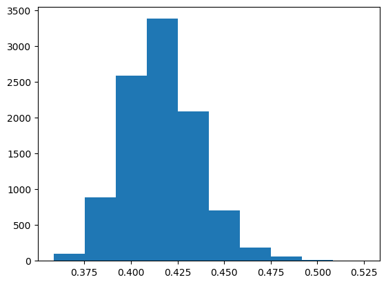


```python
plt.scatter(x = CIFAR10_output_values_of_predicted_outputs, y = CIFAR10_uncertainties)
print("Scatterplot of softmax value of predicted output (x) and uncertainty (y):")
plt.show()
```

    Scatterplot of softmax value of predicted output (x) and uncertainty (y):


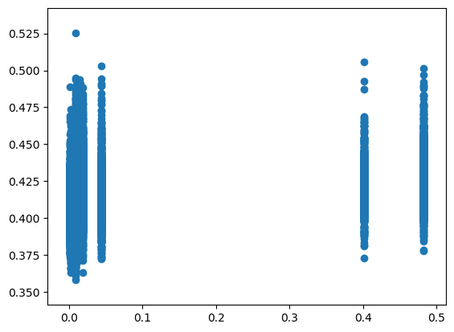


```python
print("Variance of singular LeNet's outputs for each input")
print(describe(CIFAR10_variance))
plt.hist(CIFAR10_variance)
plt.show()
```

    Variance of singular LeNet's outputs for each input
    DescribeResult(nobs=10000, minmax=(0.0021103793, 0.08998039), mean=0.03779819, variance=0.0004947748, skewness=0.6577903032302856, kurtosis=-0.6184693050458754)


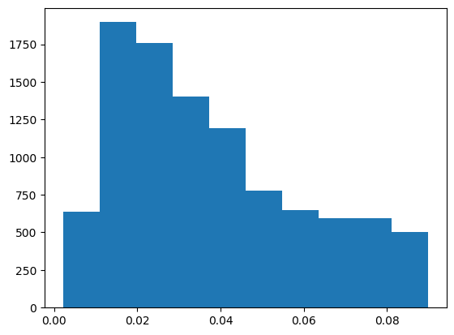


```python
print(len(CIFAR10_different_instances_between_voting_and_averaging))
print(1 - len(CIFAR10_different_instances_between_voting_and_averaging)/len(CIFAR10_testX))
print(describe(CIFAR10_vote_ratios_of_predicted_outputs))
plt.hist(CIFAR10_vote_ratios_of_predicted_outputs)
plt.show()
```

    923
    0.9077
    DescribeResult(nobs=10000, minmax=(0.2, 1.0), mean=0.7926200000000002, variance=0.0462581614161416, skewness=-0.5399851253200995, kurtosis=-1.0190638985768017)


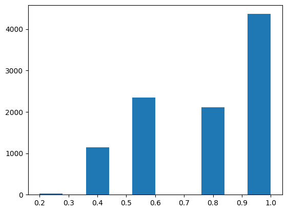


## SVHN


```python
print("Statistical description of uncertainty values:")
print(describe(SVHN_uncertainties))
print("Histogram of uncertainty values:")
plt.hist(SVHN_uncertainties)
plt.show()
```

    Statistical description of uncertainty values:
    DescribeResult(nobs=26032, minmax=(0.356147822889074, 0.5513952463050045), mean=0.4228043386375172, variance=0.00036190354133291123, skewness=0.342876763676606, kurtosis=0.5203275123281168)
    Histogram of uncertainty values:


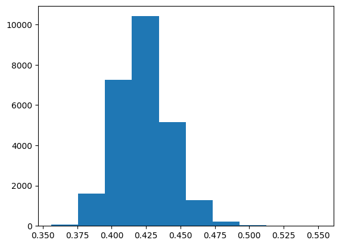


```python
plt.scatter(x = SVHN_output_values_of_predicted_outputs, y = SVHN_uncertainties)
print("Scatterplot of softmax value of predicted output (x) and uncertainty (y):")
plt.show()
```

    Scatterplot of softmax value of predicted output (x) and uncertainty (y):


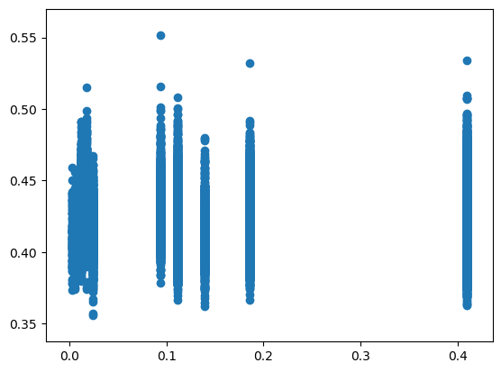


```python
print("Variance of singular LeNet's outputs for each input")
print(describe(SVHN_variance))
plt.hist(SVHN_variance)
plt.show()
```

    Variance of singular LeNet's outputs for each input
    DescribeResult(nobs=26032, minmax=(0.0010314643, 0.08724675), mean=0.018835854, variance=0.00010176495, skewness=1.8372098207473755, kurtosis=5.079396359891726)


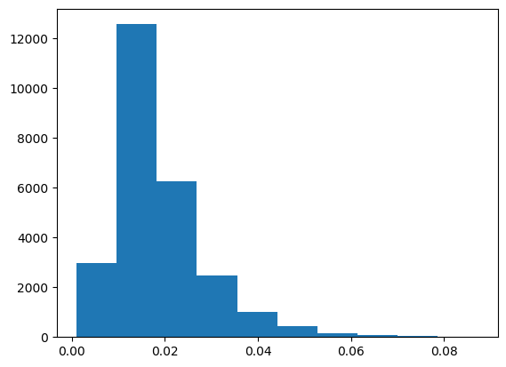


```python
print(len(SVHN_different_instances_between_voting_and_averaging))
print(1 - len(SVHN_different_instances_between_voting_and_averaging)/len(SVHN_testX))
print(describe(SVHN_vote_ratios_of_predicted_outputs))
plt.hist(SVHN_vote_ratios_of_predicted_outputs)
plt.show()
```

    3797
    0.854141057160418
    DescribeResult(nobs=26032, minmax=(0.2, 1.0), mean=0.6729025814382299, variance=0.03695614770644722, skewness=0.23569474695063097, kurtosis=-0.7703875495484458)


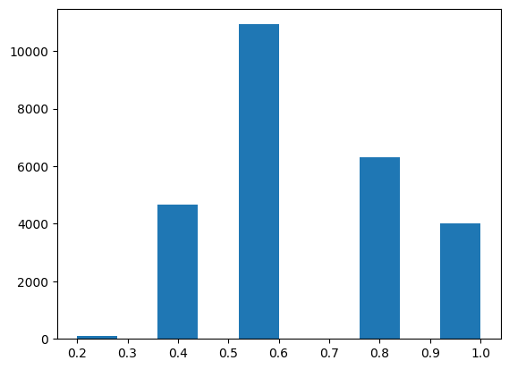


## MNIST


```python
print("Statistical description of uncertainty values:")
print(describe(MNIST_uncertainties))
print("Histogram of uncertainty values:")
plt.hist(MNIST_uncertainties)
plt.show()
```

    Statistical description of uncertainty values:
    DescribeResult(nobs=10000, minmax=(0.39120492846729427, 0.5380580144049585), mean=0.43705680345239345, variance=0.0002668787214216823, skewness=0.7596672340715919, kurtosis=1.4022972402867584)
    Histogram of uncertainty values:


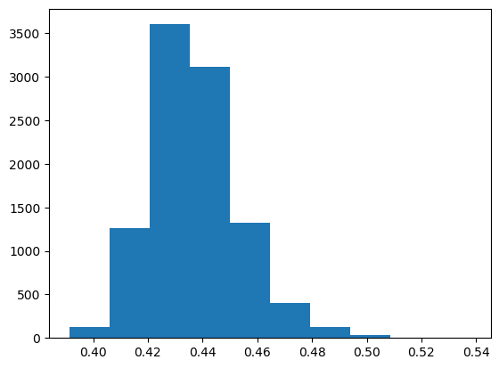


```python
plt.scatter(x = MNIST_output_values_of_predicted_outputs, y = MNIST_uncertainties)
print("Scatterplot of softmax value of predicted output (x) and uncertainty (y):")
plt.show()
```

    Scatterplot of softmax value of predicted output (x) and uncertainty (y):


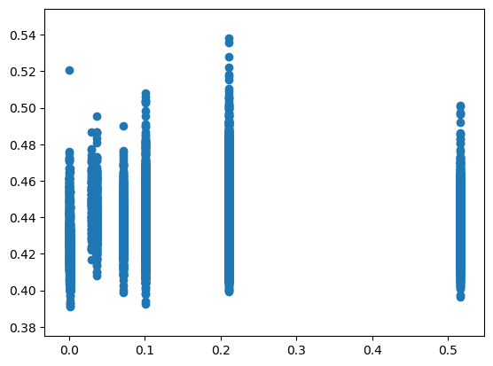


```python
print("Variance of singular LeNet's outputs for each input")
print(describe(MNIST_variance))
plt.hist(MNIST_variance)
plt.show()
```

    Variance of singular LeNet's outputs for each input
    DescribeResult(nobs=10000, minmax=(0.00664753, 0.0886909), mean=0.0486407, variance=0.0003919806, skewness=0.1321200430393219, kurtosis=-0.9588845984766667)


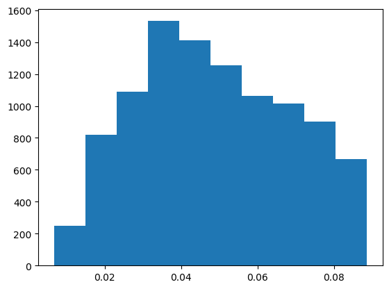


```python
print(len(MNIST_different_instances_between_voting_and_averaging))
print(1 - len(MNIST_different_instances_between_voting_and_averaging)/len(MNIST_testX))
print(describe(MNIST_vote_ratios_of_predicted_outputs))
plt.hist(MNIST_vote_ratios_of_predicted_outputs)
plt.show()
```

    1490
    0.851
    DescribeResult(nobs=10000, minmax=(0.2, 1.0), mean=0.66924, variance=0.034217244124412446, skewness=0.12229645000234608, kurtosis=-0.7324699053670432)


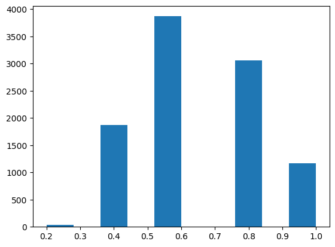


## NotMNIST


```python
print("Statistical description of uncertainty values:")
print(describe(NotMNIST_uncertainties))
print("Histogram of uncertainty values:")
plt.hist(NotMNIST_uncertainties)
plt.show()
```

    Statistical description of uncertainty values:
    DescribeResult(nobs=18724, minmax=(0.3735247220717762, 0.5842761586156465), mean=0.4364091141942271, variance=0.00029063793315392116, skewness=0.31962839570408796, kurtosis=0.8069906267774978)
    Histogram of uncertainty values:


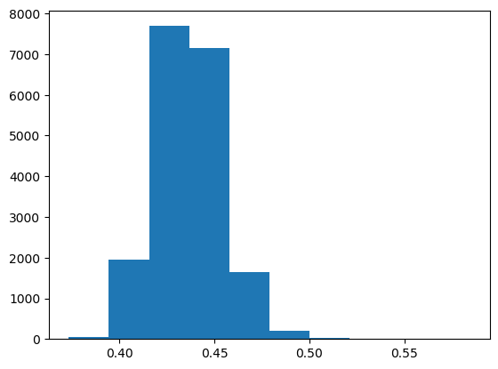


```python
plt.scatter(x = NotMNIST_output_values_of_predicted_outputs, y = NotMNIST_uncertainties)
print("Scatterplot of softmax value of predicted output (x) and uncertainty (y):")
plt.show()
```

    Scatterplot of softmax value of predicted output (x) and uncertainty (y):


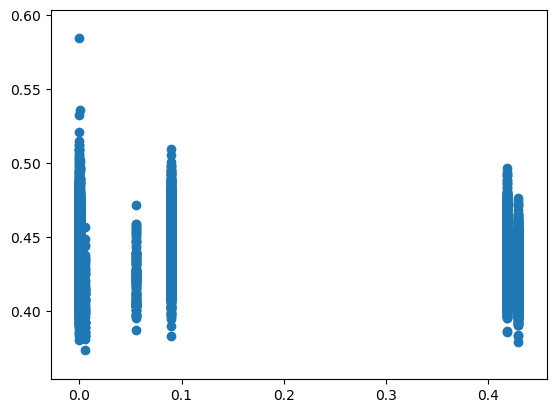


```python
print("Variance of singular LeNet's outputs for each input")
print(describe(NotMNIST_variance))
plt.hist(NotMNIST_variance)
plt.show()
```

    Variance of singular LeNet's outputs for each input
    DescribeResult(nobs=18724, minmax=(0.0053336835, 0.08994019), mean=0.04889373, variance=0.00046209604, skewness=0.1366906315088272, kurtosis=-1.11474227052873)


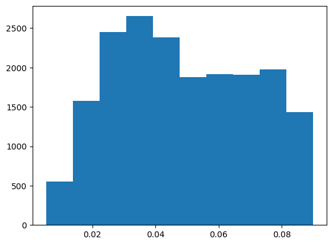


```python
print(describe(NotMNIST_vote_ratios_of_predicted_outputs))
plt.hist(NotMNIST_vote_ratios_of_predicted_outputs)
plt.show()
```

    DescribeResult(nobs=18724, minmax=(0.2, 1.0), mean=0.6753685110019226, variance=0.04216631721807866, skewness=0.14245808569464843, kurtosis=-1.0470929310730932)


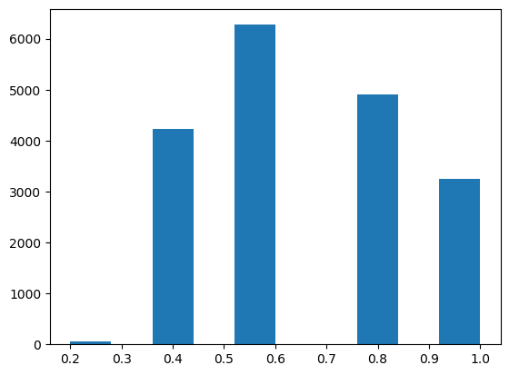

