```python
import os
```


```python
os.chdir("../core/")
```


```python
%%capture
from load_datasets import *
from ensemble import *
from saliency import *
from scipy.stats import describe
```


```python
(SVHN_trainX, SVHN_trainY),(SVHN_testX, SVHN_testY) = load_data("SVHN")
(MNIST_trainX, MNIST_trainY),(MNIST_testX, MNIST_testY) = load_data("MNIST")
NotMNIST = load_data("NotMNIST")
(CIFAR10_trainX, CIFAR10_trainY),(CIFAR10_testX, CIFAR10_testY) = load_data("CIFAR10")
```

    WARNING:absl:Warning: Setting shuffle_files=True because split=TRAIN and shuffle_files=None. This behavior will be deprecated on 2019-08-06, at which point shuffle_files=False will be the default for all splits.


    ../../datasets/notMNIST_small/A
    Could not read: ../../datasets/notMNIST_small/A/RGVtb2NyYXRpY2FCb2xkT2xkc3R5bGUgQm9sZC50dGY=.png : Could not find a format to read the specified file in single-image mode - it's ok, skipping.
    ../../datasets/notMNIST_small/B
    ../../datasets/notMNIST_small/C
    ../../datasets/notMNIST_small/D
    ../../datasets/notMNIST_small/E
    ../../datasets/notMNIST_small/F
    Could not read: ../../datasets/notMNIST_small/F/Q3Jvc3NvdmVyIEJvbGRPYmxpcXVlLnR0Zg==.png : Could not find a format to read the specified file in single-image mode - it's ok, skipping.
    ../../datasets/notMNIST_small/G
    ../../datasets/notMNIST_small/H
    ../../datasets/notMNIST_small/I
    ../../datasets/notMNIST_small/J


```python
MNIST_trainX,MNIST_testX = pad_dataset(MNIST_trainX),pad_dataset(MNIST_testX)
NotMNIST = pad_dataset(NotMNIST)
```

# Creating ensemble


```python
CIFAR10_lenet = get_lenet(input_shape = np.shape(CIFAR10_trainX[0]))
train_network(network = CIFAR10_lenet, trainX = CIFAR10_trainX, trainY = CIFAR10_trainY)
CIFAR10_lenets = clone_network_into_ensemble(number_of_networks = 5, network = CIFAR10_lenet)
train_ensemble(ensemble = CIFAR10_lenets, trainX = CIFAR10_trainX, trainY = CIFAR10_trainY)
```

    WARNING:tensorflow:From /users/ai/u7ysrv/anaconda3/envs/samel/lib/python3.7/site-packages/keras/backend/tensorflow_backend.py:74: The name tf.get_default_graph is deprecated. Please use tf.compat.v1.get_default_graph instead.
    
    WARNING:tensorflow:From /users/ai/u7ysrv/anaconda3/envs/samel/lib/python3.7/site-packages/keras/backend/tensorflow_backend.py:517: The name tf.placeholder is deprecated. Please use tf.compat.v1.placeholder instead.
    
    WARNING:tensorflow:From /users/ai/u7ysrv/anaconda3/envs/samel/lib/python3.7/site-packages/keras/backend/tensorflow_backend.py:4138: The name tf.random_uniform is deprecated. Please use tf.random.uniform instead.
    
    WARNING:tensorflow:From /users/ai/u7ysrv/anaconda3/envs/samel/lib/python3.7/site-packages/keras/backend/tensorflow_backend.py:3976: The name tf.nn.max_pool is deprecated. Please use tf.nn.max_pool2d instead.
    
    WARNING:tensorflow:From /users/ai/u7ysrv/anaconda3/envs/samel/lib/python3.7/site-packages/keras/optimizers.py:790: The name tf.train.Optimizer is deprecated. Please use tf.compat.v1.train.Optimizer instead.
    
    WARNING:tensorflow:From /users/ai/u7ysrv/anaconda3/envs/samel/lib/python3.7/site-packages/keras/backend/tensorflow_backend.py:3295: The name tf.log is deprecated. Please use tf.math.log instead.
    
    WARNING:tensorflow:From /users/ai/u7ysrv/anaconda3/envs/samel/lib/python3.7/site-packages/tensorflow/python/ops/math_grad.py:1250: add_dispatch_support.<locals>.wrapper (from tensorflow.python.ops.array_ops) is deprecated and will be removed in a future version.
    Instructions for updating:
    Use tf.where in 2.0, which has the same broadcast rule as np.where


    Epoch 1/5
    50000/50000 [==============================] - 13s 254us/step - loss: 1.8571 - acc: 0.3323
    Epoch 2/5
    50000/50000 [==============================] - 10s 195us/step - loss: 1.5035 - acc: 0.4650
    Epoch 3/5
    50000/50000 [==============================] - 10s 193us/step - loss: 1.3566 - acc: 0.5193
    Epoch 4/5
    50000/50000 [==============================] - 10s 194us/step - loss: 1.2461 - acc: 0.5609
    Epoch 5/5
    50000/50000 [==============================] - 10s 192us/step - loss: 1.1455 - acc: 0.5985
    Epoch 1/5
    50000/50000 [==============================] - 11s 216us/step - loss: 1.8377 - acc: 0.3405
    Epoch 2/5
    50000/50000 [==============================] - 10s 201us/step - loss: 1.4850 - acc: 0.4695
    Epoch 3/5
    50000/50000 [==============================] - 10s 201us/step - loss: 1.3307 - acc: 0.5290
    Epoch 4/5
    50000/50000 [==============================] - 10s 201us/step - loss: 1.2137 - acc: 0.5720
    Epoch 5/5
    50000/50000 [==============================] - 10s 201us/step - loss: 1.1175 - acc: 0.6065
    Epoch 1/5
    50000/50000 [==============================] - 10s 208us/step - loss: 1.8582 - acc: 0.3340
    Epoch 2/5
    50000/50000 [==============================] - 10s 202us/step - loss: 1.4716 - acc: 0.4750
    Epoch 3/5
    50000/50000 [==============================] - 10s 203us/step - loss: 1.3106 - acc: 0.5369
    Epoch 4/5
    50000/50000 [==============================] - 10s 203us/step - loss: 1.1927 - acc: 0.5788
    Epoch 5/5
    50000/50000 [==============================] - 10s 201us/step - loss: 1.0949 - acc: 0.6152
    Epoch 1/5
    50000/50000 [==============================] - 10s 205us/step - loss: 1.8333 - acc: 0.3423
    Epoch 2/5
    50000/50000 [==============================] - 10s 195us/step - loss: 1.4777 - acc: 0.4746
    Epoch 3/5
    50000/50000 [==============================] - 10s 194us/step - loss: 1.3312 - acc: 0.5287
    Epoch 4/5
    50000/50000 [==============================] - 10s 194us/step - loss: 1.2166 - acc: 0.5731
    Epoch 5/5
    50000/50000 [==============================] - 10s 195us/step - loss: 1.1153 - acc: 0.6107
    Epoch 1/5
    50000/50000 [==============================] - 10s 208us/step - loss: 1.8432 - acc: 0.3393
    Epoch 2/5
    50000/50000 [==============================] - 10s 199us/step - loss: 1.4806 - acc: 0.4715
    Epoch 3/5
    50000/50000 [==============================] - 10s 199us/step - loss: 1.3250 - acc: 0.5314
    Epoch 4/5
    50000/50000 [==============================] - 10s 198us/step - loss: 1.2076 - acc: 0.5723
    Epoch 5/5
    50000/50000 [==============================] - 10s 197us/step - loss: 1.1094 - acc: 0.6131
    Epoch 1/5
    50000/50000 [==============================] - 10s 206us/step - loss: 1.8239 - acc: 0.3438
    Epoch 2/5
    50000/50000 [==============================] - 10s 198us/step - loss: 1.4422 - acc: 0.4875
    Epoch 3/5
    50000/50000 [==============================] - 10s 196us/step - loss: 1.3018 - acc: 0.5371
    Epoch 4/5
    50000/50000 [==============================] - 10s 195us/step - loss: 1.1976 - acc: 0.5795
    Epoch 5/5
    50000/50000 [==============================] - 10s 197us/step - loss: 1.1080 - acc: 0.6128


    [<keras.engine.sequential.Sequential at 0x7fed400eb5d0>,
     <keras.engine.sequential.Sequential at 0x7fed28597e90>,
     <keras.engine.sequential.Sequential at 0x7fed2847d890>,
     <keras.engine.sequential.Sequential at 0x7fed283ce210>,
     <keras.engine.sequential.Sequential at 0x7fed283168d0>]


```python
CIFAR10_optimizers = get_ensemble_optimisers(ensemble = CIFAR10_lenets, grad_cam = True)
```

# Extracting data

## CIFAR10


```python
CIFAR10_outputs_values = get_ensemble_output_values_for_multiple_inputs(ensemble = CIFAR10_lenets, inputs = CIFAR10_testX, number_of_output_nodes = 10)
CIFAR10_predicted_outputs = get_ensemble_predicted_outputs(ensemble = CIFAR10_lenets, inputs = CIFAR10_testX, number_of_output_nodes = 10)
CIFAR10_output_values_of_predicted_outputs = np.take(CIFAR10_outputs_values,CIFAR10_predicted_outputs)
```


```python
CIFAR10_ensemble_votes = get_ensemble_votes_for_multiple_inputs(CIFAR10_lenets,CIFAR10_testX,10)
CIFAR10_majority_voting_predicted_outputs = np.argmax(CIFAR10_ensemble_votes,axis = 1)
CIFAR10_vote_ratios_of_predicted_outputs = np.max(CIFAR10_ensemble_votes,axis = 1)/5
CIFAR10_different_instances_between_voting_and_averaging = np.nonzero(CIFAR10_majority_voting_predicted_outputs-CIFAR10_predicted_outputs)[0]
```


```python
CIFAR10_saliency_maps = generate_ensemble_saliency_maps_for_multiple_inputs(
    ensemble = CIFAR10_lenets,
    inputs = CIFAR10_testX,
    output_nodes = CIFAR10_predicted_outputs,
    optimisers = CIFAR10_optimizers,
    visualised_layer = 9,
    grad_cam = True)

CIFAR10_uncertainties = calculate_uncertainties_with_maps(CIFAR10_saliency_maps)
```

    100%|██████████| 10000/10000 [00:41<00:00, 241.51it/s]
    100%|██████████| 10000/10000 [00:41<00:00, 240.29it/s]
    100%|██████████| 10000/10000 [00:41<00:00, 240.62it/s]
    100%|██████████| 10000/10000 [00:41<00:00, 239.01it/s]
    100%|██████████| 10000/10000 [00:41<00:00, 241.44it/s]


```python
CIFAR10_singular_predictions_values = CIFAR10_lenet.predict(CIFAR10_testX)
```


```python
CIFAR10_variance = np.var(CIFAR10_singular_predictions_values,axis = 1)
```

## SVHN


```python
SVHN_outputs_values = get_ensemble_output_values_for_multiple_inputs(ensemble = CIFAR10_lenets, inputs = SVHN_testX, number_of_output_nodes = 10)
SVHN_predicted_outputs = get_ensemble_predicted_outputs(ensemble = CIFAR10_lenets, inputs = SVHN_testX, number_of_output_nodes = 10)
SVHN_output_values_of_predicted_outputs = np.take(SVHN_outputs_values,SVHN_predicted_outputs)
```


```python
SVHN_ensemble_votes = get_ensemble_votes_for_multiple_inputs(CIFAR10_lenets,SVHN_testX,10)
SVHN_majority_voting_predicted_outputs = np.argmax(SVHN_ensemble_votes,axis = 1)
SVHN_vote_ratios_of_predicted_outputs = np.max(SVHN_ensemble_votes,axis = 1)/5
SVHN_different_instances_between_voting_and_averaging = np.nonzero(SVHN_majority_voting_predicted_outputs-SVHN_predicted_outputs)[0]
```


```python
SVHN_saliency_maps = generate_ensemble_saliency_maps_for_multiple_inputs(
    ensemble = CIFAR10_lenets,
    inputs = SVHN_testX,
    output_nodes = SVHN_predicted_outputs,
    optimisers = CIFAR10_optimizers,
    visualised_layer = 9,
    grad_cam = True)

SVHN_uncertainties = calculate_uncertainties_with_maps(SVHN_saliency_maps)
```

    100%|██████████| 26032/26032 [01:45<00:00, 246.99it/s]
    100%|██████████| 26032/26032 [01:45<00:00, 246.21it/s]
    100%|██████████| 26032/26032 [01:44<00:00, 248.09it/s]
    100%|██████████| 26032/26032 [01:45<00:00, 247.82it/s]
    100%|██████████| 26032/26032 [01:45<00:00, 247.70it/s]


```python
SVHN_singular_predictions_values = CIFAR10_lenet.predict(SVHN_testX)
```


```python
SVHN_variance = np.var(SVHN_singular_predictions_values,axis = 1)
```

## MNIST


```python
MNIST_outputs_values = get_ensemble_output_values_for_multiple_inputs(ensemble = CIFAR10_lenets, inputs = MNIST_testX, number_of_output_nodes = 10)
MNIST_predicted_outputs = get_ensemble_predicted_outputs(ensemble = CIFAR10_lenets, inputs = MNIST_testX, number_of_output_nodes = 10)
MNIST_output_values_of_predicted_outputs = np.take(MNIST_outputs_values,MNIST_predicted_outputs)
```


```python
MNIST_ensemble_votes = get_ensemble_votes_for_multiple_inputs(CIFAR10_lenets,MNIST_testX,10)
MNIST_majority_voting_predicted_outputs = np.argmax(MNIST_ensemble_votes,axis = 1)
MNIST_vote_ratios_of_predicted_outputs = np.max(MNIST_ensemble_votes,axis = 1)/5
MNIST_different_instances_between_voting_and_averaging = np.nonzero(MNIST_majority_voting_predicted_outputs-MNIST_predicted_outputs)[0]
```


```python
MNIST_saliency_maps = generate_ensemble_saliency_maps_for_multiple_inputs(
    ensemble = CIFAR10_lenets,
    inputs = MNIST_testX,
    output_nodes = MNIST_predicted_outputs,
    optimisers = CIFAR10_optimizers,
    visualised_layer = 9,
    grad_cam = True)

MNIST_uncertainties = calculate_uncertainties_with_maps(MNIST_saliency_maps)
```

    100%|██████████| 10000/10000 [00:40<00:00, 247.01it/s]
    100%|██████████| 10000/10000 [00:39<00:00, 251.72it/s]
    100%|██████████| 10000/10000 [00:39<00:00, 250.47it/s]
    100%|██████████| 10000/10000 [00:40<00:00, 247.02it/s]
    100%|██████████| 10000/10000 [00:40<00:00, 248.19it/s]


```python
MNIST_singular_predictions_values = CIFAR10_lenet.predict(MNIST_testX)
```


```python
MNIST_variance = np.var(MNIST_singular_predictions_values,axis = 1)
```

## NotMNIST


```python
NotMNIST_outputs_values = get_ensemble_output_values_for_multiple_inputs(ensemble = CIFAR10_lenets, inputs = NotMNIST, number_of_output_nodes = 10)
NotMNIST_predicted_outputs = get_ensemble_predicted_outputs(ensemble = CIFAR10_lenets, inputs = NotMNIST, number_of_output_nodes = 10)
NotMNIST_output_values_of_predicted_outputs = np.take(NotMNIST_outputs_values,NotMNIST_predicted_outputs)
```


```python
NotMNIST_ensemble_votes = get_ensemble_votes_for_multiple_inputs(CIFAR10_lenets,NotMNIST,10)
NotMNIST_majority_voting_predicted_outputs = np.argmax(NotMNIST_ensemble_votes,axis = 1)
NotMNIST_vote_ratios_of_predicted_outputs = np.max(NotMNIST_ensemble_votes,axis = 1)/5
NotMNIST_different_instances_between_voting_and_averaging = np.nonzero(NotMNIST_majority_voting_predicted_outputs-NotMNIST_predicted_outputs)[0]
```


```python
NotMNIST_saliency_maps = generate_ensemble_saliency_maps_for_multiple_inputs(
    ensemble = CIFAR10_lenets,
    inputs = NotMNIST,
    output_nodes = NotMNIST_predicted_outputs,
    optimisers = CIFAR10_optimizers,
    visualised_layer = 9,
    grad_cam = True)

NotMNIST_uncertainties = calculate_uncertainties_with_maps(NotMNIST_saliency_maps)
```

    100%|██████████| 18724/18724 [01:15<00:00, 248.65it/s]
    100%|██████████| 18724/18724 [01:15<00:00, 248.65it/s]
    100%|██████████| 18724/18724 [01:14<00:00, 250.02it/s]
    100%|██████████| 18724/18724 [01:15<00:00, 249.00it/s]
    100%|██████████| 18724/18724 [01:15<00:00, 248.34it/s]


```python
NotMNIST_singular_predictions_values = CIFAR10_lenet.predict(NotMNIST)
```


```python
NotMNIST_variance = np.var(NotMNIST_singular_predictions_values,axis = 1)
```

# Exploring data


```python
plt.style.use('default')
```


```python
# General evaluation
print("Evaluation (loss,acc) of singular LeNet:")
print(CIFAR10_lenet.evaluate(CIFAR10_testX, CIFAR10_testY))
print("")
print("Evaluation (loss,acc) of each LeNet in the ensemble:")
for lenet in CIFAR10_lenets:
    print(lenet.evaluate(CIFAR10_testX, CIFAR10_testY))
print("")
print("Accuracy of ensemble:")
print(evaluate_ensemble_accuracy(CIFAR10_lenets,CIFAR10_testX,CIFAR10_testY))
print("")
print("Averaged softmax output values of any output node of the ensemble:")
print(describe(CIFAR10_outputs_values,axis=None))
print("")
print("Averaged softmax output values of the ensemble's predicted outputs:")
print(describe(CIFAR10_output_values_of_predicted_outputs))
print("")
print("Softmax output values of the singular LeNet's outputs:")
print(describe(CIFAR10_lenet.predict(CIFAR10_testX),axis = None))
print("")
```

    Evaluation (loss,acc) of singular LeNet:
    10000/10000 [==============================] - 1s 129us/step
    [1.1629932266235352, 0.5862]
    
    Evaluation (loss,acc) of each LeNet in the ensemble:
    10000/10000 [==============================] - 1s 126us/step
    [1.1347037804603577, 0.6039]
    10000/10000 [==============================] - 1s 123us/step
    [1.108856947517395, 0.6122]
    10000/10000 [==============================] - 1s 125us/step
    [1.1333748756408693, 0.602]
    10000/10000 [==============================] - 1s 126us/step
    [1.151338999938965, 0.5883]
    10000/10000 [==============================] - 1s 128us/step
    [1.1409892805099486, 0.5922]
    
    Accuracy of ensemble:
    0.6385
    
    Averaged softmax output values of any output node of the ensemble:
    DescribeResult(nobs=100000, minmax=(6.075945035988184e-09, 0.999832272529602), mean=0.09999999998959083, variance=0.033986427990638474, skewness=2.696815336625528, kurtosis=7.284894828028335)
    
    Averaged softmax output values of the ensemble's predicted outputs:
    DescribeResult(nobs=10000, minmax=(0.0024549890018533914, 0.47135226130485536), mean=0.09762813821614605, variance=0.027218043593040583, skewness=1.5932794350073192, kurtosis=0.6686968232158432)
    
    Softmax output values of the singular LeNet's outputs:
    DescribeResult(nobs=100000, minmax=(2.2486433e-09, 0.9993082), mean=0.09999999, variance=0.03621096, skewness=2.748204231262207, kurtosis=7.436076128089768)
    


## CIFAR10


```python
print("Statistical description of uncertainty values:")
print(describe(CIFAR10_uncertainties))
print("Histogram of uncertainty values:")
plt.hist(CIFAR10_uncertainties)
plt.show()
```

    Statistical description of uncertainty values:
    DescribeResult(nobs=10000, minmax=(0.17477860052914024, 1.998046875), mean=0.3998940134455539, variance=0.005326058096327459, skewness=1.457054180572864, kurtosis=24.04039503199208)
    Histogram of uncertainty values:


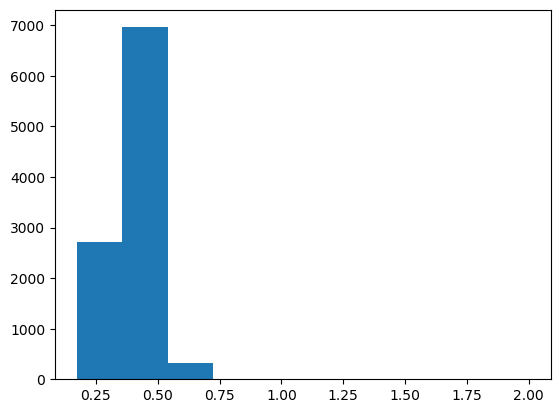


```python
plt.scatter(x = CIFAR10_output_values_of_predicted_outputs, y = CIFAR10_uncertainties)
print("Scatterplot of softmax value of predicted output (x) and uncertainty (y):")
plt.show()
```

    Scatterplot of softmax value of predicted output (x) and uncertainty (y):


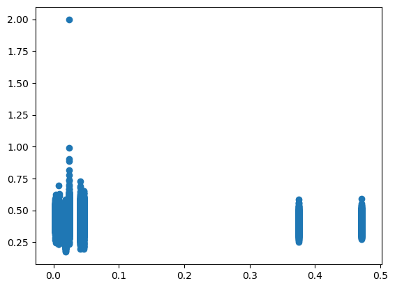


```python
print("Variance of singular LeNet's outputs for each input")
print(describe(CIFAR10_variance))
plt.hist(CIFAR10_variance)
plt.show()
```

    Variance of singular LeNet's outputs for each input
    DescribeResult(nobs=10000, minmax=(0.0012564308, 0.089861706), mean=0.0362106, variance=0.0005420526, skewness=0.6504297852516174, kurtosis=-0.6993496385032798)


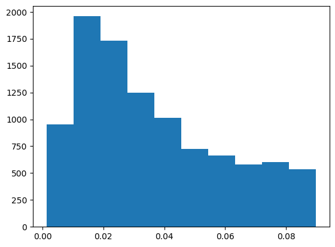


```python
print(len(CIFAR10_different_instances_between_voting_and_averaging))
print(1 - len(CIFAR10_different_instances_between_voting_and_averaging)/len(CIFAR10_testX))
print(describe(CIFAR10_vote_ratios_of_predicted_outputs))
plt.hist(CIFAR10_vote_ratios_of_predicted_outputs)
plt.show()
```

    800
    0.92
    DescribeResult(nobs=10000, minmax=(0.2, 1.0), mean=0.81786, variance=0.04108112851285129, skewness=-0.6900680408306815, kurtosis=-0.7706532541535149)


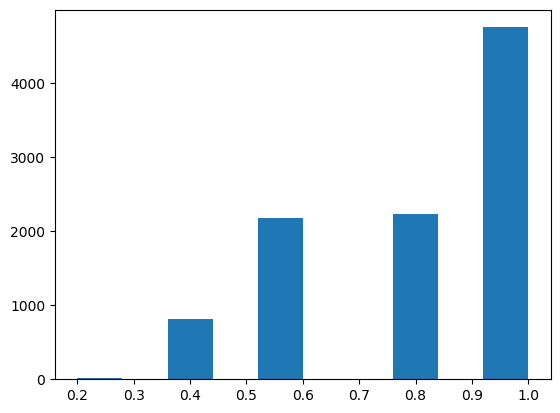


## SVHN


```python
print("Statistical description of uncertainty values:")
print(describe(SVHN_uncertainties))
print("Histogram of uncertainty values:")
plt.hist(SVHN_uncertainties)
plt.show()
```

    Statistical description of uncertainty values:
    DescribeResult(nobs=26032, minmax=(0.17410447763066644, 1.3236177292818607), mean=0.3875548819618597, variance=0.005143232402871594, skewness=0.8391220371262881, kurtosis=2.3862609021218955)
    Histogram of uncertainty values:


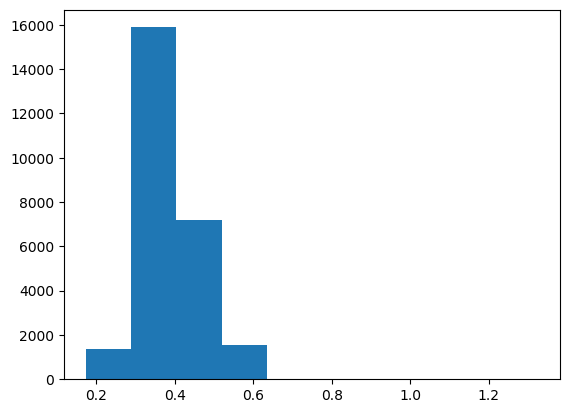


```python
plt.scatter(x = SVHN_output_values_of_predicted_outputs, y = SVHN_uncertainties)
print("Scatterplot of softmax value of predicted output (x) and uncertainty (y):")
plt.show()
```

    Scatterplot of softmax value of predicted output (x) and uncertainty (y):


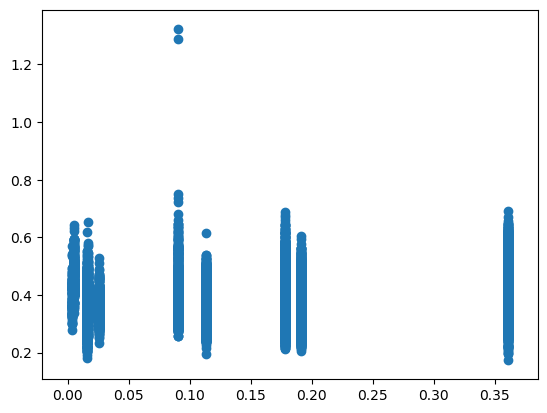


```python
print("Variance of singular LeNet's outputs for each input")
print(describe(SVHN_variance))
plt.hist(SVHN_variance)
plt.show()
```

    Variance of singular LeNet's outputs for each input
    DescribeResult(nobs=26032, minmax=(0.00058674254, 0.083764955), mean=0.01573316, variance=9.9331286e-05, skewness=1.762560248374939, kurtosis=4.382235526563204)


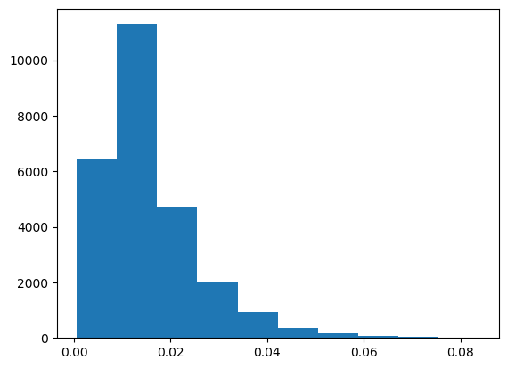


```python
print(len(SVHN_different_instances_between_voting_and_averaging))
print(1 - len(SVHN_different_instances_between_voting_and_averaging)/len(SVHN_testX))
print(describe(SVHN_vote_ratios_of_predicted_outputs))
plt.hist(SVHN_vote_ratios_of_predicted_outputs)
plt.show()
```

    3283
    0.8738859864781807
    DescribeResult(nobs=26032, minmax=(0.2, 1.0), mean=0.7270590043023971, variance=0.04335982625982066, skewness=-0.07461431590566524, kurtosis=-1.1609355600481708)


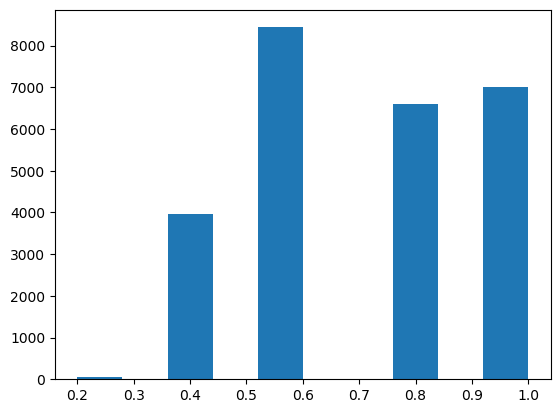


## MNIST


```python
print("Statistical description of uncertainty values:")
print(describe(MNIST_uncertainties))
print("Histogram of uncertainty values:")
plt.hist(MNIST_uncertainties)
plt.show()
```

    Statistical description of uncertainty values:
    DescribeResult(nobs=10000, minmax=(0.22303686221399488, 1.036941912686462), mean=0.4265785703729184, variance=0.003983931677929012, skewness=0.8109376208406325, kurtosis=3.075757647697145)
    Histogram of uncertainty values:


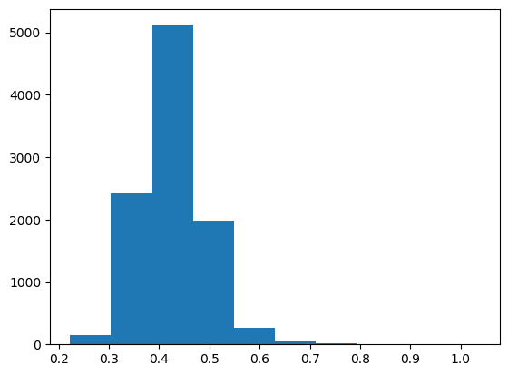


```python
plt.scatter(x = MNIST_output_values_of_predicted_outputs, y = MNIST_uncertainties)
print("Scatterplot of softmax value of predicted output (x) and uncertainty (y):")
plt.show()
```

    Scatterplot of softmax value of predicted output (x) and uncertainty (y):


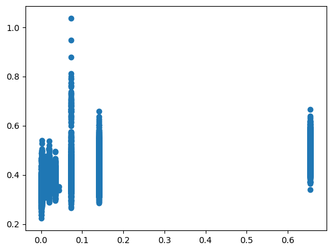


```python
print("Variance of singular LeNet's outputs for each input")
print(describe(MNIST_variance))
plt.hist(MNIST_variance)
plt.show()
```

    Variance of singular LeNet's outputs for each input
    DescribeResult(nobs=10000, minmax=(0.0060132276, 0.08642717), mean=0.03513059, variance=0.0002608073, skewness=0.683641791343689, kurtosis=-0.30859447834622644)


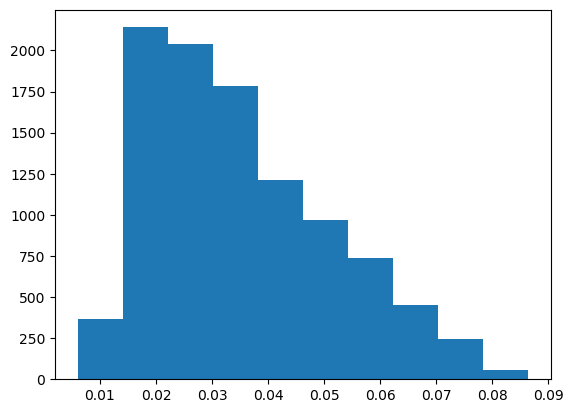


```python
print(len(MNIST_different_instances_between_voting_and_averaging))
print(1 - len(MNIST_different_instances_between_voting_and_averaging)/len(MNIST_testX))
print(describe(MNIST_vote_ratios_of_predicted_outputs))
plt.hist(MNIST_vote_ratios_of_predicted_outputs)
plt.show()
```

    1329
    0.8671
    DescribeResult(nobs=10000, minmax=(0.2, 1.0), mean=0.7091200000000001, variance=0.04277710331033103, skewness=-0.00839048252918007, kurtosis=-1.0442052250397527)


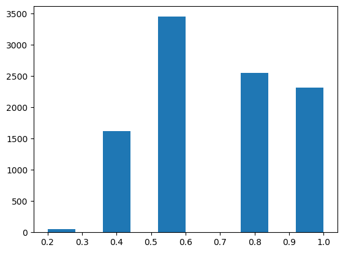


## NotMNIST


```python
print("Statistical description of uncertainty values:")
print(describe(NotMNIST_uncertainties))
print("Histogram of uncertainty values:")
plt.hist(NotMNIST_uncertainties)
plt.show()
```

    Statistical description of uncertainty values:
    DescribeResult(nobs=18724, minmax=(0.20997928231349525, 0.6839436888002657), mean=0.3835937148123154, variance=0.003912244606824114, skewness=0.4745651561028298, kurtosis=0.6449302560934362)
    Histogram of uncertainty values:


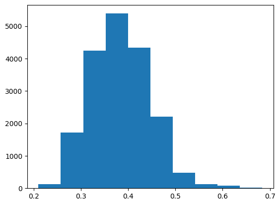


```python
plt.scatter(x = NotMNIST_output_values_of_predicted_outputs, y = NotMNIST_uncertainties)
print("Scatterplot of softmax value of predicted output (x) and uncertainty (y):")
plt.show()
```

    Scatterplot of softmax value of predicted output (x) and uncertainty (y):


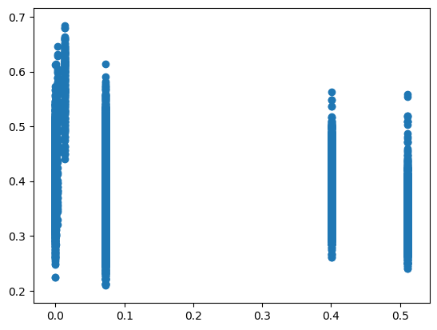


```python
print("Variance of singular LeNet's outputs for each input")
print(describe(NotMNIST_variance))
plt.hist(NotMNIST_variance)
plt.show()
```

    Variance of singular LeNet's outputs for each input
    DescribeResult(nobs=18724, minmax=(0.0027187094, 0.08959352), mean=0.03515173, variance=0.0003519586, skewness=0.76054847240448, kurtosis=-0.16019261325156275)


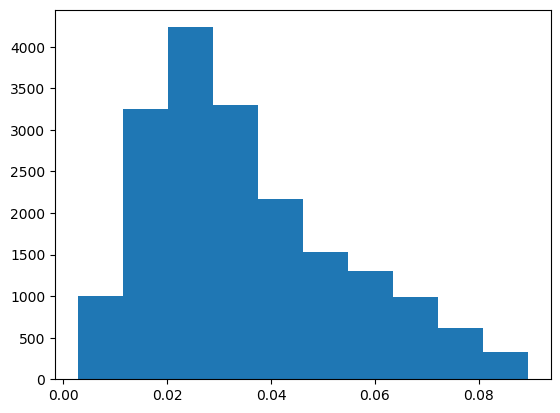


```python
print(describe(NotMNIST_vote_ratios_of_predicted_outputs))
plt.hist(NotMNIST_vote_ratios_of_predicted_outputs)
plt.show()
```

    DescribeResult(nobs=18724, minmax=(0.2, 1.0), mean=0.7510574663533433, variance=0.04556689965102836, skewness=-0.2810309631943487, kurtosis=-1.1563382705144225)


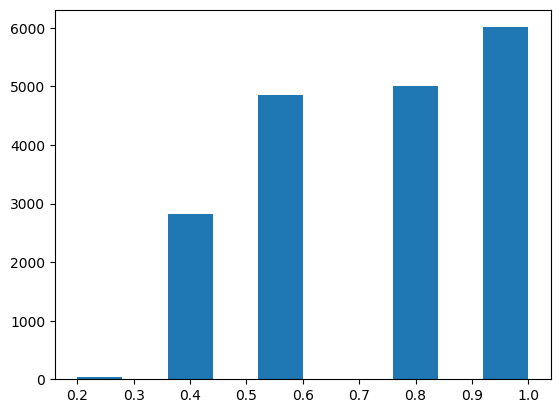

