```python
import os
```


```python
os.chdir("../core/")
```


```python
%%capture
from load_datasets import *
from ensemble import *
from saliency import *
from scipy.stats import describe
```


```python
(SVHN_trainX, SVHN_trainY),(SVHN_testX, SVHN_testY) = load_data("SVHN")
(MNIST_trainX, MNIST_trainY),(MNIST_testX, MNIST_testY) = load_data("MNIST")
NotMNIST = load_data("NotMNIST")
(CIFAR10_trainX, CIFAR10_trainY),(CIFAR10_testX, CIFAR10_testY) = load_data("CIFAR10")
```

    WARNING:absl:Warning: Setting shuffle_files=True because split=TRAIN and shuffle_files=None. This behavior will be deprecated on 2019-08-06, at which point shuffle_files=False will be the default for all splits.


    ../../datasets/notMNIST_small/A
    Could not read: ../../datasets/notMNIST_small/A/RGVtb2NyYXRpY2FCb2xkT2xkc3R5bGUgQm9sZC50dGY=.png : Could not find a format to read the specified file in single-image mode - it's ok, skipping.
    ../../datasets/notMNIST_small/B
    ../../datasets/notMNIST_small/C
    ../../datasets/notMNIST_small/D
    ../../datasets/notMNIST_small/E
    ../../datasets/notMNIST_small/F
    Could not read: ../../datasets/notMNIST_small/F/Q3Jvc3NvdmVyIEJvbGRPYmxpcXVlLnR0Zg==.png : Could not find a format to read the specified file in single-image mode - it's ok, skipping.
    ../../datasets/notMNIST_small/G
    ../../datasets/notMNIST_small/H
    ../../datasets/notMNIST_small/I
    ../../datasets/notMNIST_small/J


```python
SVHN_trainX,SVHN_testX,CIFAR10_trainX,CIFAR10_testX = crop_32_to_28(SVHN_trainX),crop_32_to_28(SVHN_testX),crop_32_to_28(CIFAR10_trainX),crop_32_to_28(CIFAR10_testX)
SVHN_trainX,SVHN_testX,CIFAR10_trainX,CIFAR10_testX = make_monochrome(SVHN_trainX),make_monochrome(SVHN_testX),make_monochrome(CIFAR10_trainX),make_monochrome(CIFAR10_testX)
```

# Creating ensemble


```python
MNIST_lenet = get_lenet(input_shape = np.shape(MNIST_trainX[0]))
train_network(network = MNIST_lenet, trainX = MNIST_trainX, trainY = MNIST_trainY)
MNIST_lenets = clone_network_into_ensemble(number_of_networks = 5, network = MNIST_lenet)
train_ensemble(ensemble = MNIST_lenets, trainX = MNIST_trainX, trainY = MNIST_trainY)
```

    WARNING:tensorflow:From /users/ai/u7ysrv/anaconda3/envs/samel/lib/python3.7/site-packages/keras/backend/tensorflow_backend.py:74: The name tf.get_default_graph is deprecated. Please use tf.compat.v1.get_default_graph instead.
    
    WARNING:tensorflow:From /users/ai/u7ysrv/anaconda3/envs/samel/lib/python3.7/site-packages/keras/backend/tensorflow_backend.py:517: The name tf.placeholder is deprecated. Please use tf.compat.v1.placeholder instead.
    
    WARNING:tensorflow:From /users/ai/u7ysrv/anaconda3/envs/samel/lib/python3.7/site-packages/keras/backend/tensorflow_backend.py:4138: The name tf.random_uniform is deprecated. Please use tf.random.uniform instead.
    
    WARNING:tensorflow:From /users/ai/u7ysrv/anaconda3/envs/samel/lib/python3.7/site-packages/keras/backend/tensorflow_backend.py:3976: The name tf.nn.max_pool is deprecated. Please use tf.nn.max_pool2d instead.
    
    WARNING:tensorflow:From /users/ai/u7ysrv/anaconda3/envs/samel/lib/python3.7/site-packages/keras/optimizers.py:790: The name tf.train.Optimizer is deprecated. Please use tf.compat.v1.train.Optimizer instead.
    
    WARNING:tensorflow:From /users/ai/u7ysrv/anaconda3/envs/samel/lib/python3.7/site-packages/keras/backend/tensorflow_backend.py:3295: The name tf.log is deprecated. Please use tf.math.log instead.
    
    WARNING:tensorflow:From /users/ai/u7ysrv/anaconda3/envs/samel/lib/python3.7/site-packages/tensorflow/python/ops/math_grad.py:1250: add_dispatch_support.<locals>.wrapper (from tensorflow.python.ops.array_ops) is deprecated and will be removed in a future version.
    Instructions for updating:
    Use tf.where in 2.0, which has the same broadcast rule as np.where


    Epoch 1/5
    60000/60000 [==============================] - 14s 237us/step - loss: 0.4047 - acc: 0.8882
    Epoch 2/5
    60000/60000 [==============================] - 11s 184us/step - loss: 0.1059 - acc: 0.9680
    Epoch 3/5
    60000/60000 [==============================] - 11s 186us/step - loss: 0.0736 - acc: 0.9778
    Epoch 4/5
    60000/60000 [==============================] - 11s 184us/step - loss: 0.0583 - acc: 0.9822
    Epoch 5/5
    60000/60000 [==============================] - 11s 184us/step - loss: 0.0495 - acc: 0.9849
    Epoch 1/5
    60000/60000 [==============================] - 12s 198us/step - loss: 0.4157 - acc: 0.8779
    Epoch 2/5
    60000/60000 [==============================] - 11s 184us/step - loss: 0.1064 - acc: 0.9682
    Epoch 3/5
    60000/60000 [==============================] - 11s 182us/step - loss: 0.0742 - acc: 0.9776
    Epoch 4/5
    60000/60000 [==============================] - 11s 186us/step - loss: 0.0588 - acc: 0.9821
    Epoch 5/5
    60000/60000 [==============================] - 11s 184us/step - loss: 0.0488 - acc: 0.9849
    Epoch 1/5
    60000/60000 [==============================] - 12s 193us/step - loss: 0.4287 - acc: 0.8780
    Epoch 2/5
    60000/60000 [==============================] - 11s 186us/step - loss: 0.1069 - acc: 0.9683
    Epoch 3/5
    60000/60000 [==============================] - 11s 185us/step - loss: 0.0739 - acc: 0.9771
    Epoch 4/5
    60000/60000 [==============================] - 11s 185us/step - loss: 0.0586 - acc: 0.9819
    Epoch 5/5
    60000/60000 [==============================] - 11s 185us/step - loss: 0.0491 - acc: 0.9852
    Epoch 1/5
    60000/60000 [==============================] - 12s 195us/step - loss: 0.3826 - acc: 0.8887
    Epoch 2/5
    60000/60000 [==============================] - 11s 187us/step - loss: 0.1080 - acc: 0.9676
    Epoch 3/5
    60000/60000 [==============================] - 11s 189us/step - loss: 0.0756 - acc: 0.9766
    Epoch 4/5
    60000/60000 [==============================] - 11s 188us/step - loss: 0.0605 - acc: 0.9814
    Epoch 5/5
    60000/60000 [==============================] - 11s 189us/step - loss: 0.0504 - acc: 0.9842
    Epoch 1/5
    60000/60000 [==============================] - 12s 197us/step - loss: 0.4220 - acc: 0.8792
    Epoch 2/5
    60000/60000 [==============================] - 11s 187us/step - loss: 0.1052 - acc: 0.9682
    Epoch 3/5
    60000/60000 [==============================] - 11s 186us/step - loss: 0.0726 - acc: 0.9779
    Epoch 4/5
    60000/60000 [==============================] - 11s 189us/step - loss: 0.0567 - acc: 0.9828
    Epoch 5/5
    60000/60000 [==============================] - 11s 188us/step - loss: 0.0481 - acc: 0.9854
    Epoch 1/5
    60000/60000 [==============================] - 12s 196us/step - loss: 0.4270 - acc: 0.8795
    Epoch 2/5
    60000/60000 [==============================] - 11s 186us/step - loss: 0.1070 - acc: 0.9680
    Epoch 3/5
    60000/60000 [==============================] - 11s 185us/step - loss: 0.0744 - acc: 0.9773
    Epoch 4/5
    60000/60000 [==============================] - 11s 183us/step - loss: 0.0593 - acc: 0.9815
    Epoch 5/5
    60000/60000 [==============================] - 11s 184us/step - loss: 0.0498 - acc: 0.9846


    [<keras.engine.sequential.Sequential at 0x7f201028be90>,
     <keras.engine.sequential.Sequential at 0x7f1ff47094d0>,
     <keras.engine.sequential.Sequential at 0x7f1ff465f190>,
     <keras.engine.sequential.Sequential at 0x7f1ff45a7ad0>,
     <keras.engine.sequential.Sequential at 0x7f1ff447f190>]


```python
MNIST_optimizers = get_ensemble_optimisers(ensemble = MNIST_lenets)
```

# Extracting data

## MNIST


```python
MNIST_outputs_values = get_ensemble_output_values_for_multiple_inputs(ensemble = MNIST_lenets, inputs = MNIST_testX, number_of_output_nodes = 10)
MNIST_predicted_outputs = get_ensemble_predicted_outputs(ensemble = MNIST_lenets, inputs = MNIST_testX, number_of_output_nodes = 10)
MNIST_output_values_of_predicted_outputs = np.take(MNIST_outputs_values,MNIST_predicted_outputs)
```


```python
MNIST_ensemble_votes = get_ensemble_votes_for_multiple_inputs(MNIST_lenets,MNIST_testX,10)
MNIST_majority_voting_predicted_outputs = np.argmax(MNIST_ensemble_votes,axis = 1)
MNIST_vote_ratios_of_predicted_outputs = np.max(MNIST_ensemble_votes,axis = 1)/5
MNIST_different_instances_between_voting_and_averaging = np.nonzero(MNIST_majority_voting_predicted_outputs-MNIST_predicted_outputs)[0]
```


```python
MNIST_saliency_maps = generate_ensemble_saliency_maps_for_multiple_inputs(
    ensemble = MNIST_lenets,
    inputs = MNIST_testX,
    output_nodes = MNIST_predicted_outputs,
    optimisers = MNIST_optimizers,
    visualised_layer = 9)

MNIST_uncertainties = calculate_uncertainties_with_maps(MNIST_saliency_maps)
```

    100%|██████████| 10000/10000 [00:35<00:00, 280.34it/s]
    100%|██████████| 10000/10000 [00:35<00:00, 279.88it/s]
    100%|██████████| 10000/10000 [00:35<00:00, 283.05it/s]
    100%|██████████| 10000/10000 [00:35<00:00, 283.48it/s]
    100%|██████████| 10000/10000 [00:35<00:00, 280.52it/s]


```python
MNIST_singular_predictions_values = MNIST_lenet.predict(MNIST_testX)
```


```python
MNIST_variance = np.var(MNIST_singular_predictions_values,axis = 1)
```

## NotMNIST


```python
NotMNIST_outputs_values = get_ensemble_output_values_for_multiple_inputs(ensemble = MNIST_lenets, inputs = NotMNIST, number_of_output_nodes = 10)
NotMNIST_predicted_outputs = get_ensemble_predicted_outputs(ensemble = MNIST_lenets, inputs = NotMNIST, number_of_output_nodes = 10)
NotMNIST_output_values_of_predicted_outputs = np.take(NotMNIST_outputs_values,NotMNIST_predicted_outputs)
```


```python
NotMNIST_ensemble_votes = get_ensemble_votes_for_multiple_inputs(MNIST_lenets,NotMNIST,10)
NotMNIST_majority_voting_predicted_outputs = np.argmax(NotMNIST_ensemble_votes,axis = 1)
NotMNIST_vote_ratios_of_predicted_outputs = np.max(NotMNIST_ensemble_votes,axis = 1)/5
NotMNIST_different_instances_between_voting_and_averaging = np.nonzero(NotMNIST_majority_voting_predicted_outputs-NotMNIST_predicted_outputs)[0]
```


```python
NotMNIST_saliency_maps = generate_ensemble_saliency_maps_for_multiple_inputs(
    ensemble = MNIST_lenets,
    inputs = NotMNIST,
    output_nodes = NotMNIST_predicted_outputs,
    optimisers = MNIST_optimizers,
    visualised_layer = 9)

NotMNIST_uncertainties = calculate_uncertainties_with_maps(NotMNIST_saliency_maps)
```

    100%|██████████| 18724/18724 [01:03<00:00, 292.63it/s]
    100%|██████████| 18724/18724 [01:03<00:00, 294.40it/s]
    100%|██████████| 18724/18724 [01:03<00:00, 294.55it/s]
    100%|██████████| 18724/18724 [01:03<00:00, 294.37it/s]
    100%|██████████| 18724/18724 [01:03<00:00, 293.56it/s]


```python
NotMNIST_singular_predictions_values = MNIST_lenet.predict(NotMNIST)
```


```python
NotMNIST_variance = np.var(NotMNIST_singular_predictions_values,axis = 1)
```

## SVHN


```python
SVHN_outputs_values = get_ensemble_output_values_for_multiple_inputs(ensemble = MNIST_lenets, inputs = SVHN_testX, number_of_output_nodes = 10)
SVHN_predicted_outputs = get_ensemble_predicted_outputs(ensemble = MNIST_lenets, inputs = SVHN_testX, number_of_output_nodes = 10)
SVHN_output_values_of_predicted_outputs = np.take(SVHN_outputs_values,SVHN_predicted_outputs)
```


```python
SVHN_ensemble_votes = get_ensemble_votes_for_multiple_inputs(MNIST_lenets,SVHN_testX,10)
SVHN_majority_voting_predicted_outputs = np.argmax(SVHN_ensemble_votes,axis = 1)
SVHN_vote_ratios_of_predicted_outputs = np.max(SVHN_ensemble_votes,axis = 1)/5
SVHN_different_instances_between_voting_and_averaging = np.nonzero(SVHN_majority_voting_predicted_outputs-SVHN_predicted_outputs)[0]
```


```python
SVHN_saliency_maps = generate_ensemble_saliency_maps_for_multiple_inputs(
    ensemble = MNIST_lenets,
    inputs = SVHN_testX,
    output_nodes = SVHN_predicted_outputs,
    optimisers = MNIST_optimizers,
    visualised_layer = 9)

SVHN_uncertainties = calculate_uncertainties_with_maps(SVHN_saliency_maps)
```

    100%|██████████| 26032/26032 [01:29<00:00, 292.07it/s]
    100%|██████████| 26032/26032 [01:28<00:00, 294.58it/s]
    100%|██████████| 26032/26032 [01:28<00:00, 293.03it/s]
    100%|██████████| 26032/26032 [01:28<00:00, 294.51it/s]
    100%|██████████| 26032/26032 [01:28<00:00, 293.61it/s]


```python
SVHN_singular_predictions_values = MNIST_lenet.predict(SVHN_testX)
```


```python
SVHN_variance = np.var(SVHN_singular_predictions_values,axis = 1)
```

## CIFAR10


```python
CIFAR10_outputs_values = get_ensemble_output_values_for_multiple_inputs(ensemble = MNIST_lenets, inputs = CIFAR10_testX, number_of_output_nodes = 10)
CIFAR10_predicted_outputs = get_ensemble_predicted_outputs(ensemble = MNIST_lenets, inputs = CIFAR10_testX, number_of_output_nodes = 10)
CIFAR10_output_values_of_predicted_outputs = np.take(CIFAR10_outputs_values,CIFAR10_predicted_outputs)
```


```python
CIFAR10_ensemble_votes = get_ensemble_votes_for_multiple_inputs(MNIST_lenets,CIFAR10_testX,10)
CIFAR10_majority_voting_predicted_outputs = np.argmax(CIFAR10_ensemble_votes,axis = 1)
CIFAR10_vote_ratios_of_predicted_outputs = np.max(CIFAR10_ensemble_votes,axis = 1)/5
CIFAR10_different_instances_between_voting_and_averaging = np.nonzero(CIFAR10_majority_voting_predicted_outputs-CIFAR10_predicted_outputs)[0]
```


```python
CIFAR10_saliency_maps = generate_ensemble_saliency_maps_for_multiple_inputs(
    ensemble = MNIST_lenets,
    inputs = CIFAR10_testX,
    output_nodes = CIFAR10_predicted_outputs,
    optimisers = MNIST_optimizers,
    visualised_layer = 9)

CIFAR10_uncertainties = calculate_uncertainties_with_maps(CIFAR10_saliency_maps)
```

    100%|██████████| 10000/10000 [00:34<00:00, 293.40it/s]
    100%|██████████| 10000/10000 [00:34<00:00, 293.65it/s]
    100%|██████████| 10000/10000 [00:33<00:00, 294.72it/s]
    100%|██████████| 10000/10000 [00:34<00:00, 293.62it/s]
    100%|██████████| 10000/10000 [00:34<00:00, 292.13it/s]


```python
CIFAR10_singular_predictions_values = MNIST_lenet.predict(CIFAR10_testX)
```


```python
CIFAR10_variance = np.var(CIFAR10_singular_predictions_values,axis = 1)
```

# Exploring data


```python
# General evaluation
print("Evaluation (loss,acc) of singular LeNet:")
print(MNIST_lenet.evaluate(MNIST_testX, MNIST_testY))
print("")
print("Evaluation (loss,acc) of each LeNet in the ensemble:")
for lenet in MNIST_lenets:
    print(lenet.evaluate(MNIST_testX, MNIST_testY))
print("")
print("Accuracy of ensemble:")
print(evaluate_ensemble_accuracy(MNIST_lenets,MNIST_testX,MNIST_testY))
print("")
print("Averaged softmax output values of any output node of the ensemble:")
print(describe(MNIST_outputs_values,axis=None))
print("")
print("Averaged softmax output values of the ensemble's predicted outputs:")
print(describe(MNIST_output_values_of_predicted_outputs))
print("")
print("Softmax output values of the singular LeNet's outputs:")
print(describe(MNIST_lenet.predict(MNIST_testX),axis = None))
print("")
```

    Evaluation (loss,acc) of singular LeNet:
    10000/10000 [==============================] - 1s 115us/step
    [0.038888499781442806, 0.9872]
    
    Evaluation (loss,acc) of each LeNet in the ensemble:
    10000/10000 [==============================] - 1s 110us/step
    [0.04244854835579172, 0.9859]
    10000/10000 [==============================] - 1s 106us/step
    [0.03824728052136488, 0.9874]
    10000/10000 [==============================] - 1s 110us/step
    [0.039510607007844374, 0.9881]
    10000/10000 [==============================] - 1s 110us/step
    [0.04603835249328986, 0.9855]
    10000/10000 [==============================] - 1s 112us/step
    [0.047416211558831856, 0.9841]
    
    Accuracy of ensemble:
    0.9882
    
    Averaged softmax output values of any output node of the ensemble:
    DescribeResult(nobs=100000, minmax=(5.476785107551589e-18, 1.0), mean=0.10000000021842609, variance=0.08693984569924987, skewness=2.6717882808014606, kurtosis=5.186530498261154)
    
    Averaged softmax output values of the ensemble's predicted outputs:
    DescribeResult(nobs=10000, minmax=(3.4663398860252865e-13, 0.9998008012771606), mean=0.10279976484665504, variance=0.09220047983031368, skewness=2.6157607964107745, kurtosis=4.842204797594003)
    
    Softmax output values of the singular LeNet's outputs:
    DescribeResult(nobs=100000, minmax=(7.987382e-20, 1.0), mean=0.1, variance=0.08748304, skewness=2.6710259914398193, kurtosis=5.173382764599227)
    


## MNIST


```python
plt.style.use('default')
```


```python
print("Statistical description of uncertainty values:")
print(describe(MNIST_uncertainties))
print("Histogram of uncertainty values:")
plt.hist(MNIST_uncertainties)
plt.show()
```

    Statistical description of uncertainty values:
    DescribeResult(nobs=10000, minmax=(0.5109609539153087, 0.6946916919213549), mean=0.5906888736384538, variance=0.0005857810065828667, skewness=0.3440658697046905, kurtosis=-0.009104969704201604)
    Histogram of uncertainty values:


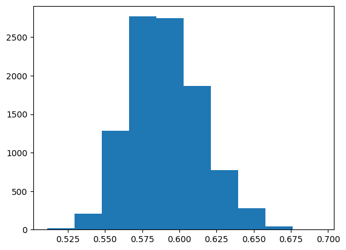


```python
plt.scatter(x = MNIST_output_values_of_predicted_outputs, y = MNIST_uncertainties)
print("Scatterplot of softmax value of predicted output (x) and uncertainty (y):")
plt.show()
```

    Scatterplot of softmax value of predicted output (x) and uncertainty (y):


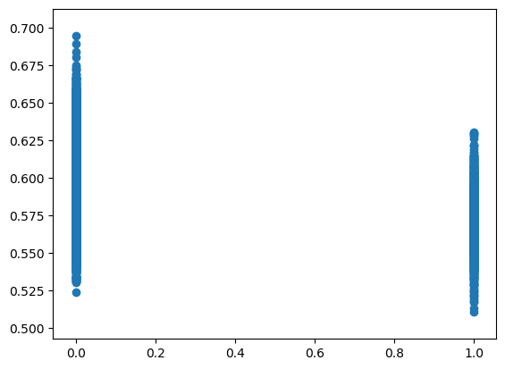


```python
print("Variance of singular LeNet's outputs for each input")
print(describe(MNIST_variance))
plt.hist(MNIST_variance)
plt.show()
```

    Variance of singular LeNet's outputs for each input
    DescribeResult(nobs=10000, minmax=(0.013991751, 0.08999999), mean=0.08748216, variance=7.52791e-05, skewness=-4.845623016357422, kurtosis=25.114969570781078)


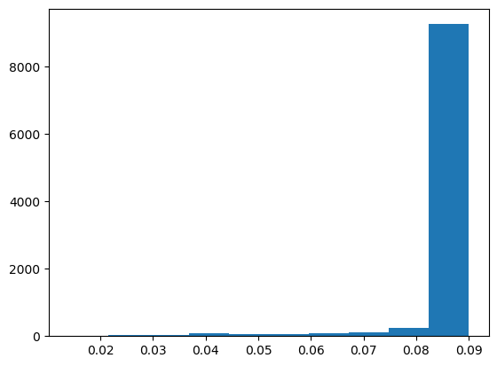


```python
print(len(MNIST_different_instances_between_voting_and_averaging))
print(1 - len(MNIST_different_instances_between_voting_and_averaging)/len(MNIST_testX))
print(describe(MNIST_vote_ratios_of_predicted_outputs))
plt.hist(MNIST_vote_ratios_of_predicted_outputs)
plt.show()
```

    22
    0.9978
    DescribeResult(nobs=10000, minmax=(0.4, 1.0), mean=0.993, variance=0.0023032303230323026, skewness=-7.565091756183901, kurtosis=60.87671294347139)


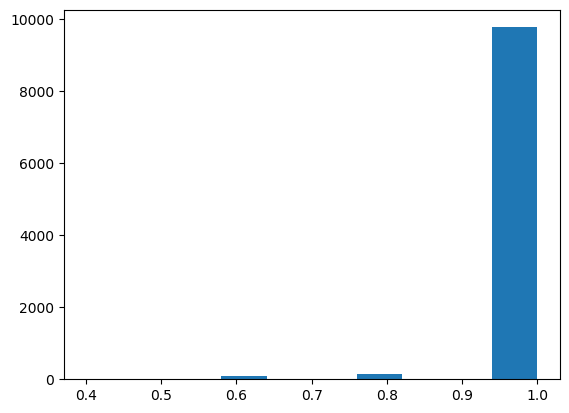


## NotMNIST


```python
print("Statistical description of uncertainty values:")
print(describe(NotMNIST_uncertainties))
print("Histogram of uncertainty values:")
plt.hist(NotMNIST_uncertainties)
plt.show()
```

    Statistical description of uncertainty values:
    DescribeResult(nobs=18724, minmax=(0.5211336965632725, 0.8404024650104815), mean=0.6269027286178042, variance=0.0007551547067650305, skewness=0.4215584405273204, kurtosis=1.8337715222434667)
    Histogram of uncertainty values:


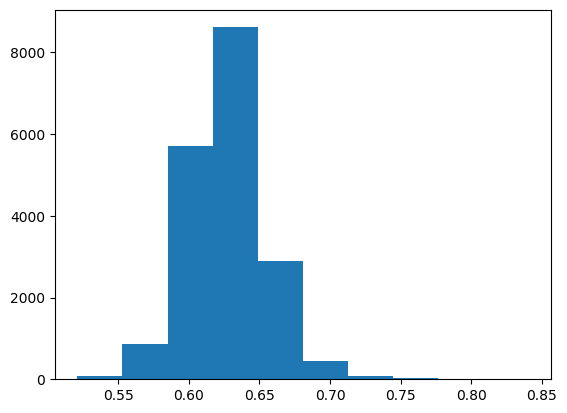


```python
plt.scatter(x = NotMNIST_output_values_of_predicted_outputs, y = NotMNIST_uncertainties)
print("Scatterplot of softmax value of predicted output (x) and uncertainty (y):")
plt.show()
```

    Scatterplot of softmax value of predicted output (x) and uncertainty (y):


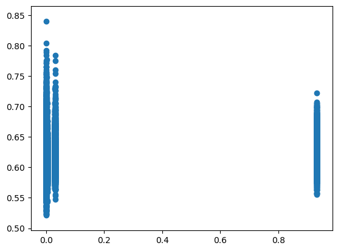


```python
print("Variance of singular LeNet's outputs for each input")
print(describe(NotMNIST_variance))
plt.hist(NotMNIST_variance)
plt.show()
```

    Variance of singular LeNet's outputs for each input
    DescribeResult(nobs=18724, minmax=(0.00012528698, 0.08998956), mean=0.042278882, variance=0.0006663505, skewness=0.37952008843421936, kurtosis=-1.0407896138951187)


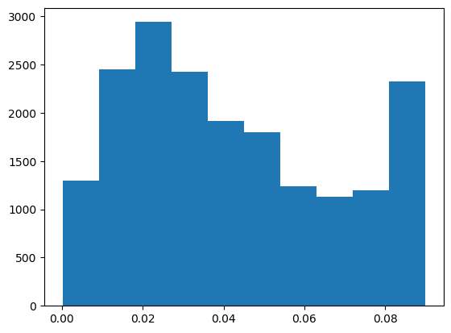


```python
print(describe(NotMNIST_vote_ratios_of_predicted_outputs))
plt.hist(NotMNIST_vote_ratios_of_predicted_outputs)
plt.show()
```

    DescribeResult(nobs=18724, minmax=(0.2, 1.0), mean=0.8214804528946806, variance=0.04002139410595308, skewness=-0.6950813070899128, kurtosis=-0.7775494097560922)


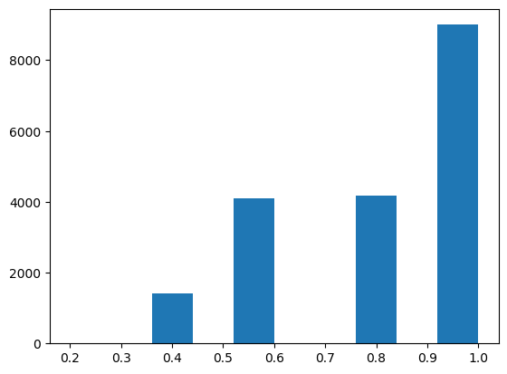


## SVHN


```python
print("Statistical description of uncertainty values:")
print(describe(SVHN_uncertainties))
print("Histogram of uncertainty values:")
plt.hist(SVHN_uncertainties)
plt.show()
```

    Statistical description of uncertainty values:
    DescribeResult(nobs=26032, minmax=(0.4957656284587176, 0.7169142620228273), mean=0.6096894626724648, variance=0.0006737498167105601, skewness=-0.4118926892861398, kurtosis=0.7951659438349936)
    Histogram of uncertainty values:


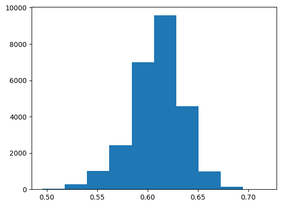


```python
plt.scatter(x = SVHN_output_values_of_predicted_outputs, y = SVHN_uncertainties)
print("Scatterplot of softmax value of predicted output (x) and uncertainty (y):")
plt.show()
```

    Scatterplot of softmax value of predicted output (x) and uncertainty (y):


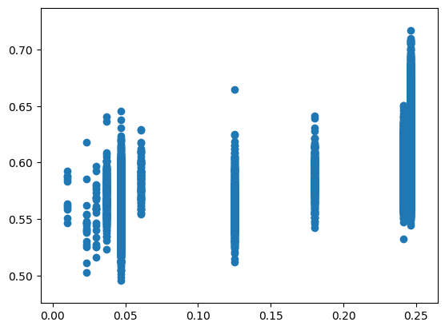


```python
print("Variance of singular LeNet's outputs for each input")
print(describe(SVHN_variance))
plt.hist(SVHN_variance)
plt.show()
```

    Variance of singular LeNet's outputs for each input
    DescribeResult(nobs=26032, minmax=(0.0013371911, 0.089976355), mean=0.042157825, variance=0.00040092948, skewness=0.388425350189209, kurtosis=-0.647593842842062)


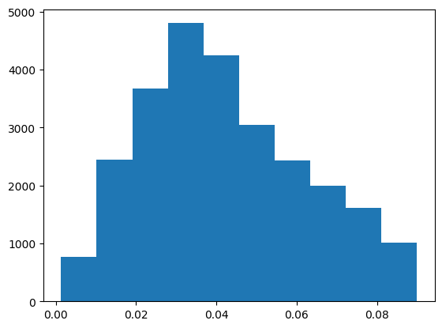


```python
print(len(SVHN_different_instances_between_voting_and_averaging))
print(1 - len(SVHN_different_instances_between_voting_and_averaging)/len(SVHN_testX))
print(describe(SVHN_vote_ratios_of_predicted_outputs))
plt.hist(SVHN_vote_ratios_of_predicted_outputs)
plt.show()
```

    2040
    0.9216349108789182
    DescribeResult(nobs=26032, minmax=(0.2, 1.0), mean=0.8259834050399508, variance=0.038846944982174225, skewness=-0.7083112733867176, kurtosis=-0.7728506902585801)


## CIFAR10


```python
print("Statistical description of uncertainty values:")
print(describe(CIFAR10_uncertainties))
print("Histogram of uncertainty values:")
plt.hist(CIFAR10_uncertainties)
plt.show()
```

    Statistical description of uncertainty values:
    DescribeResult(nobs=10000, minmax=(0.4996128352591609, 0.7024265573482272), mean=0.5998129136539154, variance=0.0006663494346544689, skewness=0.037844307147854424, kurtosis=-0.10471194758182412)
    Histogram of uncertainty values:


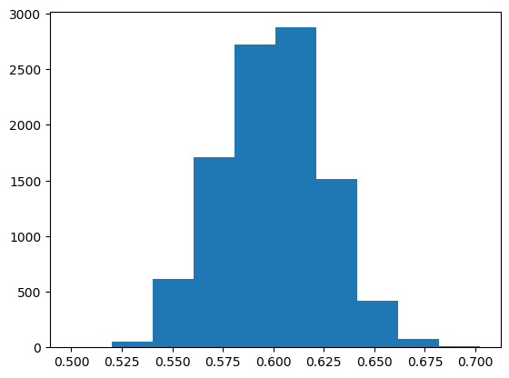


```python
plt.scatter(x = CIFAR10_output_values_of_predicted_outputs, y = CIFAR10_uncertainties)
print("Scatterplot of softmax value of predicted output (x) and uncertainty (y):")
plt.show()
```

    Scatterplot of softmax value of predicted output (x) and uncertainty (y):


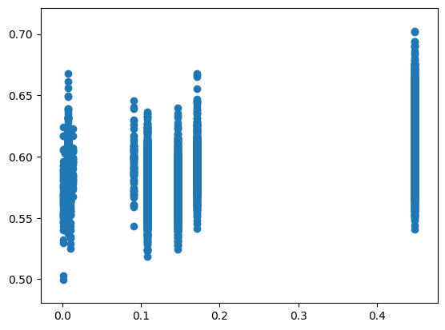


```python
print("Variance of singular LeNet's outputs for each input")
print(describe(CIFAR10_variance))
plt.hist(CIFAR10_variance)
plt.show()
```

    Variance of singular LeNet's outputs for each input
    DescribeResult(nobs=10000, minmax=(0.0033155624, 0.08973249), mean=0.04484183, variance=0.00042719577, skewness=0.2911030948162079, kurtosis=-0.9275104913437504)


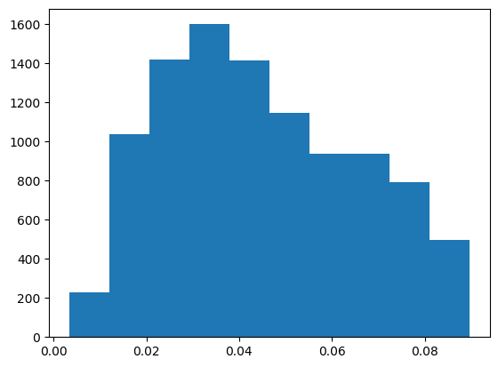


```python
print(len(CIFAR10_different_instances_between_voting_and_averaging))
print(1 - len(CIFAR10_different_instances_between_voting_and_averaging)/len(CIFAR10_testX))
print(describe(CIFAR10_vote_ratios_of_predicted_outputs))
plt.hist(CIFAR10_vote_ratios_of_predicted_outputs)
plt.show()
```

    1102
    0.8898
    DescribeResult(nobs=10000, minmax=(0.2, 1.0), mean=0.7686000000000001, variance=0.04668270827082708, skewness=-0.3670430363094069, kurtosis=-1.182493560507041)


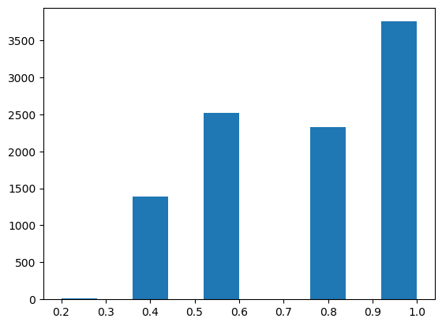

