```python
import os
```


```python
os.chdir("../core/")
```


```python
%%capture
from load_datasets import *
from ensemble import *
from saliency import *
from scipy.stats import describe
```


```python
(SVHN_trainX, SVHN_trainY),(SVHN_testX, SVHN_testY) = load_data("SVHN")
(MNIST_trainX, MNIST_trainY),(MNIST_testX, MNIST_testY) = load_data("MNIST")
NotMNIST = load_data("NotMNIST")
(CIFAR10_trainX, CIFAR10_trainY),(CIFAR10_testX, CIFAR10_testY) = load_data("CIFAR10")
```

    WARNING:absl:Warning: Setting shuffle_files=True because split=TRAIN and shuffle_files=None. This behavior will be deprecated on 2019-08-06, at which point shuffle_files=False will be the default for all splits.


    ../../datasets/notMNIST_small/A
    Could not read: ../../datasets/notMNIST_small/A/RGVtb2NyYXRpY2FCb2xkT2xkc3R5bGUgQm9sZC50dGY=.png : Could not find a format to read the specified file in single-image mode - it's ok, skipping.
    ../../datasets/notMNIST_small/B
    ../../datasets/notMNIST_small/C
    ../../datasets/notMNIST_small/D
    ../../datasets/notMNIST_small/E
    ../../datasets/notMNIST_small/F
    Could not read: ../../datasets/notMNIST_small/F/Q3Jvc3NvdmVyIEJvbGRPYmxpcXVlLnR0Zg==.png : Could not find a format to read the specified file in single-image mode - it's ok, skipping.
    ../../datasets/notMNIST_small/G
    ../../datasets/notMNIST_small/H
    ../../datasets/notMNIST_small/I
    ../../datasets/notMNIST_small/J


```python
MNIST_trainX,MNIST_testX = pad_dataset(MNIST_trainX),pad_dataset(MNIST_testX)
NotMNIST = pad_dataset(NotMNIST)
```

# Creating ensemble


```python
SVHN_lenet = get_lenet(input_shape = np.shape(SVHN_trainX[0]))
train_network(network = SVHN_lenet, trainX = SVHN_trainX, trainY = SVHN_trainY)
SVHN_lenets = clone_network_into_ensemble(number_of_networks = 5, network = SVHN_lenet)
train_ensemble(ensemble = SVHN_lenets, trainX = SVHN_trainX, trainY = SVHN_trainY)
```

    WARNING:tensorflow:From /users/ai/u7ysrv/anaconda3/envs/samel/lib/python3.7/site-packages/keras/backend/tensorflow_backend.py:74: The name tf.get_default_graph is deprecated. Please use tf.compat.v1.get_default_graph instead.
    
    WARNING:tensorflow:From /users/ai/u7ysrv/anaconda3/envs/samel/lib/python3.7/site-packages/keras/backend/tensorflow_backend.py:517: The name tf.placeholder is deprecated. Please use tf.compat.v1.placeholder instead.
    
    WARNING:tensorflow:From /users/ai/u7ysrv/anaconda3/envs/samel/lib/python3.7/site-packages/keras/backend/tensorflow_backend.py:4138: The name tf.random_uniform is deprecated. Please use tf.random.uniform instead.
    
    WARNING:tensorflow:From /users/ai/u7ysrv/anaconda3/envs/samel/lib/python3.7/site-packages/keras/backend/tensorflow_backend.py:3976: The name tf.nn.max_pool is deprecated. Please use tf.nn.max_pool2d instead.
    
    WARNING:tensorflow:From /users/ai/u7ysrv/anaconda3/envs/samel/lib/python3.7/site-packages/keras/optimizers.py:790: The name tf.train.Optimizer is deprecated. Please use tf.compat.v1.train.Optimizer instead.
    
    WARNING:tensorflow:From /users/ai/u7ysrv/anaconda3/envs/samel/lib/python3.7/site-packages/keras/backend/tensorflow_backend.py:3295: The name tf.log is deprecated. Please use tf.math.log instead.
    
    WARNING:tensorflow:From /users/ai/u7ysrv/anaconda3/envs/samel/lib/python3.7/site-packages/tensorflow/python/ops/math_grad.py:1250: add_dispatch_support.<locals>.wrapper (from tensorflow.python.ops.array_ops) is deprecated and will be removed in a future version.
    Instructions for updating:
    Use tf.where in 2.0, which has the same broadcast rule as np.where


    Epoch 1/5
    73257/73257 [==============================] - 17s 231us/step - loss: 1.9106 - acc: 0.3377
    Epoch 2/5
    73257/73257 [==============================] - 13s 182us/step - loss: 0.7704 - acc: 0.7733
    Epoch 3/5
    73257/73257 [==============================] - 13s 182us/step - loss: 0.5517 - acc: 0.8433
    Epoch 4/5
    73257/73257 [==============================] - 13s 184us/step - loss: 0.4608 - acc: 0.8702
    Epoch 5/5
    73257/73257 [==============================] - 13s 184us/step - loss: 0.4026 - acc: 0.8856
    Epoch 1/5
    73257/73257 [==============================] - 15s 202us/step - loss: 1.9323 - acc: 0.3239
    Epoch 2/5
    73257/73257 [==============================] - 14s 191us/step - loss: 0.7279 - acc: 0.7890
    Epoch 3/5
    73257/73257 [==============================] - 14s 192us/step - loss: 0.5221 - acc: 0.8552
    Epoch 4/5
    73257/73257 [==============================] - 14s 191us/step - loss: 0.4451 - acc: 0.8752
    Epoch 5/5
    73257/73257 [==============================] - 14s 191us/step - loss: 0.3935 - acc: 0.8890
    Epoch 1/5
    73257/73257 [==============================] - 15s 202us/step - loss: 2.0695 - acc: 0.2699
    Epoch 2/5
    73257/73257 [==============================] - 14s 195us/step - loss: 0.8131 - acc: 0.7591
    Epoch 3/5
    73257/73257 [==============================] - 14s 196us/step - loss: 0.5322 - acc: 0.8506
    Epoch 4/5
    73257/73257 [==============================] - 14s 194us/step - loss: 0.4508 - acc: 0.8744
    Epoch 5/5
    73257/73257 [==============================] - 14s 195us/step - loss: 0.3984 - acc: 0.8876
    Epoch 1/5
    73257/73257 [==============================] - 15s 201us/step - loss: 1.9867 - acc: 0.3072
    Epoch 2/5
    73257/73257 [==============================] - 14s 196us/step - loss: 0.7689 - acc: 0.7742
    Epoch 3/5
    73257/73257 [==============================] - 14s 196us/step - loss: 0.5276 - acc: 0.8522
    Epoch 4/5
    73257/73257 [==============================] - 14s 194us/step - loss: 0.4485 - acc: 0.8749
    Epoch 5/5
    73257/73257 [==============================] - 14s 195us/step - loss: 0.3970 - acc: 0.8890
    Epoch 1/5
    73257/73257 [==============================] - 15s 203us/step - loss: 2.0580 - acc: 0.2753
    Epoch 2/5
    73257/73257 [==============================] - 14s 195us/step - loss: 0.8153 - acc: 0.7597
    Epoch 3/5
    73257/73257 [==============================] - 14s 197us/step - loss: 0.5549 - acc: 0.8393
    Epoch 4/5
    73257/73257 [==============================] - 14s 195us/step - loss: 0.4670 - acc: 0.8655
    Epoch 5/5
    73257/73257 [==============================] - 14s 195us/step - loss: 0.4090 - acc: 0.8831
    Epoch 1/5
    73257/73257 [==============================] - 15s 202us/step - loss: 1.9802 - acc: 0.3102
    Epoch 2/5
    73257/73257 [==============================] - 14s 194us/step - loss: 0.7407 - acc: 0.7822
    Epoch 3/5
    73257/73257 [==============================] - 14s 193us/step - loss: 0.5255 - acc: 0.8527
    Epoch 4/5
    73257/73257 [==============================] - 14s 193us/step - loss: 0.4472 - acc: 0.8755
    Epoch 5/5
    73257/73257 [==============================] - 14s 195us/step - loss: 0.3958 - acc: 0.8887


    [<keras.engine.sequential.Sequential at 0x7ff7f16ce210>,
     <keras.engine.sequential.Sequential at 0x7ff7f15bf7d0>,
     <keras.engine.sequential.Sequential at 0x7ff7f04ce290>,
     <keras.engine.sequential.Sequential at 0x7ff7f0414c10>,
     <keras.engine.sequential.Sequential at 0x7ff7f02ed350>]


```python
SVHN_optimizers = get_ensemble_optimisers(ensemble = SVHN_lenets)
```

# Extracting data

## SVHN


```python
SVHN_outputs_values = get_ensemble_output_values_for_multiple_inputs(ensemble = SVHN_lenets, inputs = SVHN_testX, number_of_output_nodes = 10)
SVHN_predicted_outputs = get_ensemble_predicted_outputs(ensemble = SVHN_lenets, inputs = SVHN_testX, number_of_output_nodes = 10)
SVHN_output_values_of_predicted_outputs = np.take(SVHN_outputs_values,SVHN_predicted_outputs)
```


```python
SVHN_ensemble_votes = get_ensemble_votes_for_multiple_inputs(SVHN_lenets,SVHN_testX,10)
SVHN_majority_voting_predicted_outputs = np.argmax(SVHN_ensemble_votes,axis = 1)
SVHN_vote_ratios_of_predicted_outputs = np.max(SVHN_ensemble_votes,axis = 1)/5
SVHN_different_instances_between_voting_and_averaging = np.nonzero(SVHN_majority_voting_predicted_outputs-SVHN_predicted_outputs)[0]
```


```python
SVHN_saliency_maps = generate_ensemble_saliency_maps_for_multiple_inputs(
    ensemble = SVHN_lenets,
    inputs = SVHN_testX,
    output_nodes = SVHN_predicted_outputs,
    optimisers = SVHN_optimizers,
    visualised_layer = 9)

SVHN_uncertainties = calculate_uncertainties_with_maps(SVHN_saliency_maps)
```

    100%|██████████| 26032/26032 [01:39<00:00, 260.46it/s]
    100%|██████████| 26032/26032 [01:39<00:00, 261.58it/s]
    100%|██████████| 26032/26032 [01:38<00:00, 264.72it/s]
    100%|██████████| 26032/26032 [01:38<00:00, 264.87it/s]
    100%|██████████| 26032/26032 [01:37<00:00, 265.66it/s]


```python
SVHN_singular_predictions_values = SVHN_lenet.predict(SVHN_testX)
```


```python
SVHN_variance = np.var(SVHN_singular_predictions_values,axis = 1)
```

## CIFAR10


```python
CIFAR10_outputs_values = get_ensemble_output_values_for_multiple_inputs(ensemble = SVHN_lenets, inputs = CIFAR10_testX, number_of_output_nodes = 10)
CIFAR10_predicted_outputs = get_ensemble_predicted_outputs(ensemble = SVHN_lenets, inputs = CIFAR10_testX, number_of_output_nodes = 10)
CIFAR10_output_values_of_predicted_outputs = np.take(CIFAR10_outputs_values,CIFAR10_predicted_outputs)
```


```python
CIFAR10_ensemble_votes = get_ensemble_votes_for_multiple_inputs(SVHN_lenets,CIFAR10_testX,10)
CIFAR10_majority_voting_predicted_outputs = np.argmax(CIFAR10_ensemble_votes,axis = 1)
CIFAR10_vote_ratios_of_predicted_outputs = np.max(CIFAR10_ensemble_votes,axis = 1)/5
CIFAR10_different_instances_between_voting_and_averaging = np.nonzero(CIFAR10_majority_voting_predicted_outputs-CIFAR10_predicted_outputs)[0]
```


```python
CIFAR10_saliency_maps = generate_ensemble_saliency_maps_for_multiple_inputs(
    ensemble = SVHN_lenets,
    inputs = CIFAR10_testX,
    output_nodes = CIFAR10_predicted_outputs,
    optimisers = SVHN_optimizers,
    visualised_layer = 9)

CIFAR10_uncertainties = calculate_uncertainties_with_maps(CIFAR10_saliency_maps)
```

    100%|██████████| 10000/10000 [00:38<00:00, 262.45it/s]
    100%|██████████| 10000/10000 [00:37<00:00, 264.62it/s]
    100%|██████████| 10000/10000 [00:37<00:00, 264.51it/s]
    100%|██████████| 10000/10000 [00:37<00:00, 264.52it/s]
    100%|██████████| 10000/10000 [00:37<00:00, 263.86it/s]


```python
CIFAR10_singular_predictions_values = SVHN_lenet.predict(CIFAR10_testX)
```


```python
CIFAR10_variance = np.var(CIFAR10_singular_predictions_values,axis = 1)
```

## MNIST


```python
MNIST_outputs_values = get_ensemble_output_values_for_multiple_inputs(ensemble = SVHN_lenets, inputs = MNIST_testX, number_of_output_nodes = 10)
MNIST_predicted_outputs = get_ensemble_predicted_outputs(ensemble = SVHN_lenets, inputs = MNIST_testX, number_of_output_nodes = 10)
MNIST_output_values_of_predicted_outputs = np.take(MNIST_outputs_values,MNIST_predicted_outputs)
```


```python
MNIST_ensemble_votes = get_ensemble_votes_for_multiple_inputs(SVHN_lenets,MNIST_testX,10)
MNIST_majority_voting_predicted_outputs = np.argmax(MNIST_ensemble_votes,axis = 1)
MNIST_vote_ratios_of_predicted_outputs = np.max(MNIST_ensemble_votes,axis = 1)/5
MNIST_different_instances_between_voting_and_averaging = np.nonzero(MNIST_majority_voting_predicted_outputs-MNIST_predicted_outputs)[0]
```


```python
MNIST_saliency_maps = generate_ensemble_saliency_maps_for_multiple_inputs(
    ensemble = SVHN_lenets,
    inputs = MNIST_testX,
    output_nodes = MNIST_predicted_outputs,
    optimisers = SVHN_optimizers,
    visualised_layer = 9)

MNIST_uncertainties = calculate_uncertainties_with_maps(MNIST_saliency_maps)
```

    100%|██████████| 10000/10000 [00:37<00:00, 268.61it/s]
    100%|██████████| 10000/10000 [00:37<00:00, 268.07it/s]
    100%|██████████| 10000/10000 [00:37<00:00, 267.15it/s]
    100%|██████████| 10000/10000 [00:37<00:00, 268.35it/s]
    100%|██████████| 10000/10000 [00:37<00:00, 267.32it/s]


```python
MNIST_singular_predictions_values = SVHN_lenet.predict(MNIST_testX)
```


```python
MNIST_variance = np.var(MNIST_singular_predictions_values,axis = 1)
```

## NotMNIST


```python
NotMNIST_outputs_values = get_ensemble_output_values_for_multiple_inputs(ensemble = SVHN_lenets, inputs = NotMNIST, number_of_output_nodes = 10)
NotMNIST_predicted_outputs = get_ensemble_predicted_outputs(ensemble = SVHN_lenets, inputs = NotMNIST, number_of_output_nodes = 10)
NotMNIST_output_values_of_predicted_outputs = np.take(NotMNIST_outputs_values,NotMNIST_predicted_outputs)
```


```python
NotMNIST_ensemble_votes = get_ensemble_votes_for_multiple_inputs(SVHN_lenets,NotMNIST,10)
NotMNIST_majority_voting_predicted_outputs = np.argmax(NotMNIST_ensemble_votes,axis = 1)
NotMNIST_vote_ratios_of_predicted_outputs = np.max(NotMNIST_ensemble_votes,axis = 1)/5
NotMNIST_different_instances_between_voting_and_averaging = np.nonzero(NotMNIST_majority_voting_predicted_outputs-NotMNIST_predicted_outputs)[0]
```


```python
NotMNIST_saliency_maps = generate_ensemble_saliency_maps_for_multiple_inputs(
    ensemble = SVHN_lenets,
    inputs = NotMNIST,
    output_nodes = NotMNIST_predicted_outputs,
    optimisers = SVHN_optimizers,
    visualised_layer = 9)

NotMNIST_uncertainties = calculate_uncertainties_with_maps(NotMNIST_saliency_maps)
```

    100%|██████████| 18724/18724 [01:09<00:00, 268.44it/s]
    100%|██████████| 18724/18724 [01:09<00:00, 267.58it/s]
    100%|██████████| 18724/18724 [01:09<00:00, 268.11it/s]
    100%|██████████| 18724/18724 [01:10<00:00, 267.41it/s]
    100%|██████████| 18724/18724 [01:10<00:00, 267.46it/s]


```python
NotMNIST_singular_predictions_values = SVHN_lenet.predict(NotMNIST)
```


```python
NotMNIST_variance = np.var(NotMNIST_singular_predictions_values,axis = 1)
```

# Exploring data


```python
# General evaluation
print("Evaluation (loss,acc) of singular LeNet:")
print(SVHN_lenet.evaluate(SVHN_testX, SVHN_testY))
print("")
print("Evaluation (loss,acc) of each LeNet in the ensemble:")
for lenet in SVHN_lenets:
    print(lenet.evaluate(SVHN_testX, SVHN_testY))
print("")
print("Accuracy of ensemble:")
print(evaluate_ensemble_accuracy(SVHN_lenets,SVHN_testX,SVHN_testY))
print("")
print("Averaged softmax output values of any output node of the ensemble:")
print(describe(SVHN_outputs_values,axis=None))
print("")
print("Averaged softmax output values of the ensemble's predicted outputs:")
print(describe(SVHN_output_values_of_predicted_outputs))
print("")
print("Softmax output values of the singular LeNet's outputs:")
print(describe(SVHN_lenet.predict(SVHN_testX),axis = None))
print("")
```

    Evaluation (loss,acc) of singular LeNet:
    26032/26032 [==============================] - 3s 100us/step
    [0.4589493773012126, 0.8743085433312846]
    
    Evaluation (loss,acc) of each LeNet in the ensemble:
    26032/26032 [==============================] - 3s 99us/step
    [0.5114217328838432, 0.8586355255070682]
    26032/26032 [==============================] - 3s 101us/step
    [0.46223031609023213, 0.875]
    26032/26032 [==============================] - 3s 101us/step
    [0.47042067251875125, 0.8715043023970498]
    26032/26032 [==============================] - 3s 99us/step
    [0.47604539667123946, 0.866779348494161]
    26032/26032 [==============================] - 3s 102us/step
    [0.5569928883224011, 0.8440381069452981]
    
    Accuracy of ensemble:
    0.8857944068838353
    
    Averaged softmax output values of any output node of the ensemble:
    DescribeResult(nobs=260320, minmax=(1.4600971156143207e-23, 1.0), mean=0.10000000011204416, variance=0.0663518931926915, skewness=2.7686047748606653, kurtosis=6.172208352686834)
    
    Averaged softmax output values of the ensemble's predicted outputs:
    DescribeResult(nobs=26032, minmax=(1.3560096022047218e-06, 0.9972205400466919), mean=0.16467643796826004, variance=0.13684588207352913, skewness=1.8062804339156722, kurtosis=1.2626553415409782)
    
    Softmax output values of the singular LeNet's outputs:
    DescribeResult(nobs=260320, minmax=(3.5112462e-28, 1.0), mean=0.099999994, variance=0.06826051, skewness=2.7592315673828125, kurtosis=6.068768364652163)
    


## SVHN


```python
plt.style.use('default')
```


```python
print("Statistical description of uncertainty values:")
print(describe(SVHN_uncertainties))
print("Histogram of uncertainty values:")
plt.hist(SVHN_uncertainties)
plt.show()
```

    Statistical description of uncertainty values:
    DescribeResult(nobs=26032, minmax=(0.4620248039938905, 0.6299016724911793), mean=0.5181710538791976, variance=0.00036541812056808796, skewness=0.5406546987113185, kurtosis=0.7437026028515867)
    Histogram of uncertainty values:


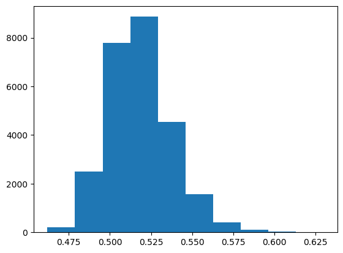


```python
plt.scatter(x = SVHN_output_values_of_predicted_outputs, y = SVHN_uncertainties)
print("Scatterplot of softmax value of predicted output (x) and uncertainty (y):")
plt.show()
```

    Scatterplot of softmax value of predicted output (x) and uncertainty (y):


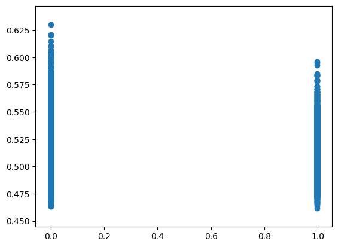


```python
print("Variance of singular LeNet's outputs for each input")
print(describe(SVHN_variance))
plt.hist(SVHN_variance)
plt.show()
```

    Variance of singular LeNet's outputs for each input
    DescribeResult(nobs=26032, minmax=(0.001566732, 0.089999996), mean=0.06826024, variance=0.00063611707, skewness=-0.9477174878120422, kurtosis=-0.4922534937182119)


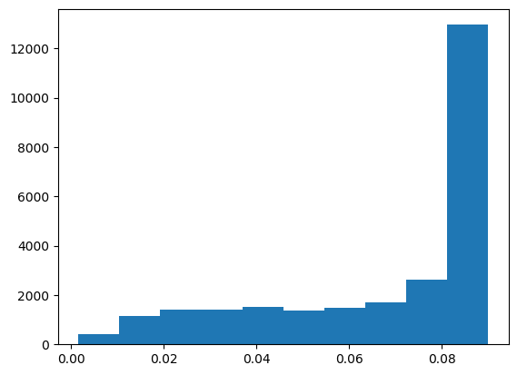


```python
print(len(SVHN_different_instances_between_voting_and_averaging))
print(1 - len(SVHN_different_instances_between_voting_and_averaging)/len(SVHN_testX))
print(describe(SVHN_vote_ratios_of_predicted_outputs))
plt.hist(SVHN_vote_ratios_of_predicted_outputs)
plt.show()
```

    667
    0.9743776889981561
    DescribeResult(nobs=26032, minmax=(0.2, 1.0), mean=0.9307621389059619, variance=0.02229056429503691, skewness=-2.159302921131149, kurtosis=3.748875566821199)


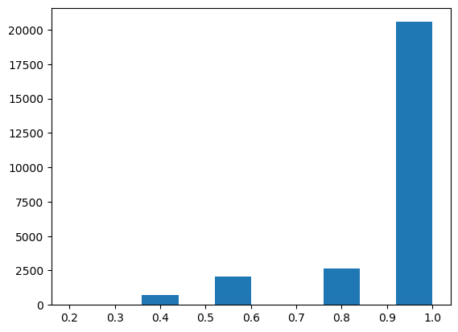


## CIFAR10


```python
print("Statistical description of uncertainty values:")
print(describe(CIFAR10_uncertainties))
print("Histogram of uncertainty values:")
plt.hist(CIFAR10_uncertainties)
plt.show()
```

    Statistical description of uncertainty values:
    DescribeResult(nobs=10000, minmax=(0.47360459327345183, 0.6343053596137954), mean=0.5304190993325624, variance=0.00034989875385492625, skewness=0.4964835130428472, kurtosis=0.7886814015645891)
    Histogram of uncertainty values:


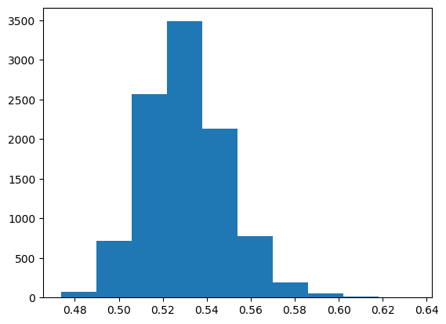


```python
plt.scatter(x = CIFAR10_output_values_of_predicted_outputs, y = CIFAR10_uncertainties)
print("Scatterplot of softmax value of predicted output (x) and uncertainty (y):")
plt.show()
```

    Scatterplot of softmax value of predicted output (x) and uncertainty (y):


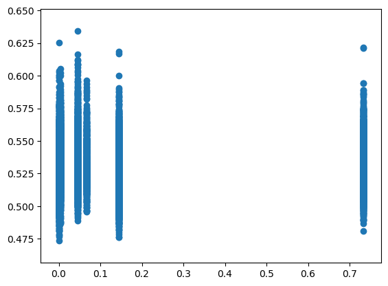


```python
print("Variance of singular LeNet's outputs for each input")
print(describe(CIFAR10_variance))
plt.hist(CIFAR10_variance)
plt.show()
```

    Variance of singular LeNet's outputs for each input
    DescribeResult(nobs=10000, minmax=(0.0021834027, 0.089999564), mean=0.03658002, variance=0.00048493294, skewness=0.7574325799942017, kurtosis=-0.41973749621094525)


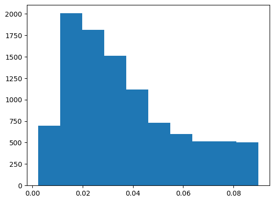


```python
print(len(CIFAR10_different_instances_between_voting_and_averaging))
print(1 - len(CIFAR10_different_instances_between_voting_and_averaging)/len(CIFAR10_testX))
print(describe(CIFAR10_vote_ratios_of_predicted_outputs))
plt.hist(CIFAR10_vote_ratios_of_predicted_outputs)
plt.show()
```

    1240
    0.876
    DescribeResult(nobs=10000, minmax=(0.2, 1.0), mean=0.6971800000000001, variance=0.045108558455845583, skewness=0.028625191557672448, kurtosis=-1.1036433195082578)


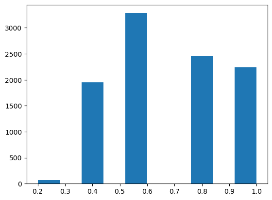


## MNIST


```python
print("Statistical description of uncertainty values:")
print(describe(MNIST_uncertainties))
print("Histogram of uncertainty values:")
plt.hist(MNIST_uncertainties)
plt.show()
```

    Statistical description of uncertainty values:
    DescribeResult(nobs=10000, minmax=(0.5157921241523763, 0.7178486736293326), mean=0.5880834648863783, variance=0.0006779848146543307, skewness=0.6140099594302623, kurtosis=0.7614506929854059)
    Histogram of uncertainty values:


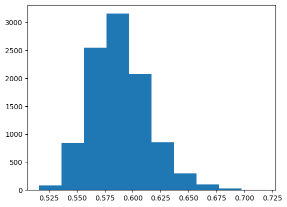


```python
plt.scatter(x = MNIST_output_values_of_predicted_outputs, y = MNIST_uncertainties)
print("Scatterplot of softmax value of predicted output (x) and uncertainty (y):")
plt.show()
```

    Scatterplot of softmax value of predicted output (x) and uncertainty (y):


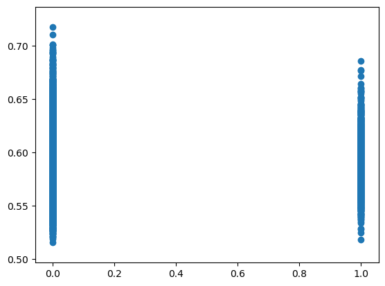


```python
print("Variance of singular LeNet's outputs for each input")
print(describe(MNIST_variance))
plt.hist(MNIST_variance)
plt.show()
```

    Variance of singular LeNet's outputs for each input
    DescribeResult(nobs=10000, minmax=(0.009665768, 0.08999999), mean=0.07320978, variance=0.00043498175, skewness=-1.0178192853927612, kurtosis=-0.33900695018876226)


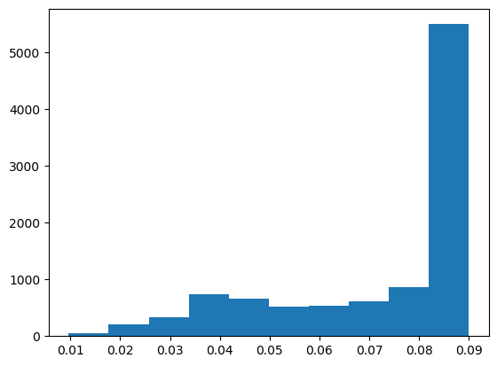


```python
print(len(MNIST_different_instances_between_voting_and_averaging))
print(1 - len(MNIST_different_instances_between_voting_and_averaging)/len(MNIST_testX))
print(describe(MNIST_vote_ratios_of_predicted_outputs))
plt.hist(MNIST_vote_ratios_of_predicted_outputs)
plt.show()
```

    477
    0.9523
    DescribeResult(nobs=10000, minmax=(0.2, 1.0), mean=0.8392799999999999, variance=0.0393890205020502, skewness=-0.8604838007409135, kurtosis=-0.5530440765853748)


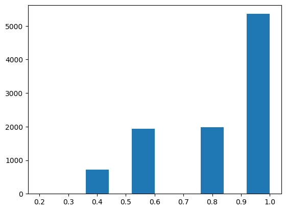


## NotMNIST


```python
print("Statistical description of uncertainty values:")
print(describe(NotMNIST_uncertainties))
print("Histogram of uncertainty values:")
plt.hist(NotMNIST_uncertainties)
plt.show()
```

    Statistical description of uncertainty values:
    DescribeResult(nobs=18724, minmax=(0.49668523405423004, 0.7376780417584772), mean=0.5751600511906176, variance=0.0009453244107555657, skewness=0.7183143833270561, kurtosis=0.8060422940269878)
    Histogram of uncertainty values:


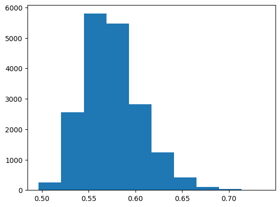


```python
plt.scatter(x = NotMNIST_output_values_of_predicted_outputs, y = NotMNIST_uncertainties)
print("Scatterplot of softmax value of predicted output (x) and uncertainty (y):")
plt.show()
```

    Scatterplot of softmax value of predicted output (x) and uncertainty (y):


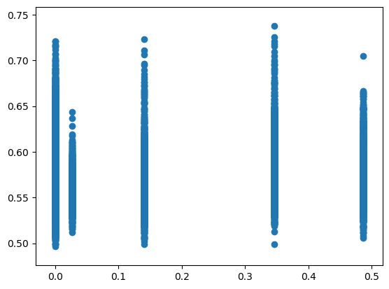


```python
print("Variance of singular LeNet's outputs for each input")
print(describe(NotMNIST_variance))
plt.hist(NotMNIST_variance)
plt.show()
```

    Variance of singular LeNet's outputs for each input
    DescribeResult(nobs=18724, minmax=(0.001231015, 0.08999999), mean=0.063431725, variance=0.00059965206, skewness=-0.5078186392784119, kurtosis=-1.0147071214904047)


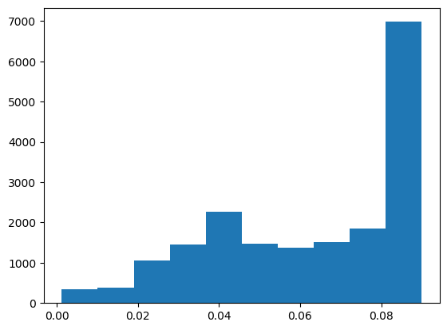


```python
print(describe(NotMNIST_vote_ratios_of_predicted_outputs))
plt.hist(NotMNIST_vote_ratios_of_predicted_outputs)
plt.show()
```

    DescribeResult(nobs=18724, minmax=(0.2, 1.0), mean=0.760681478316599, variance=0.04489738312966299, skewness=-0.3425400903410726, kurtosis=-1.0777361158865892)


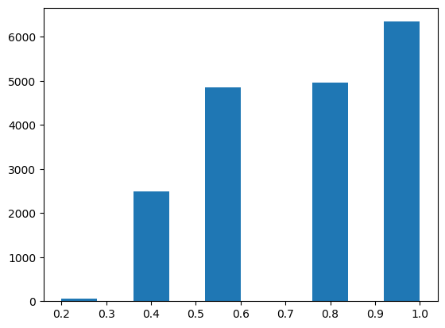

